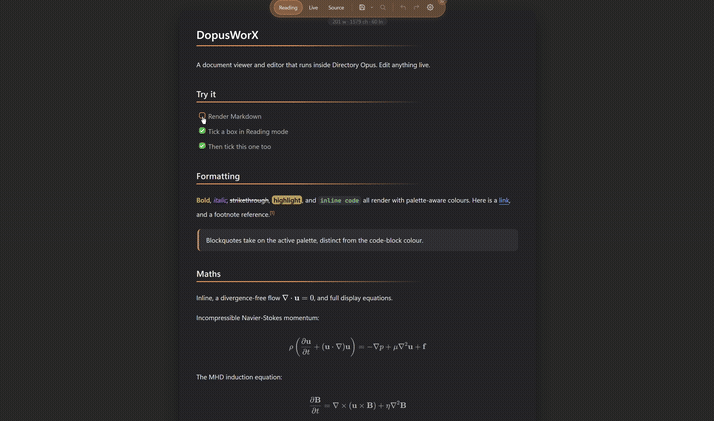
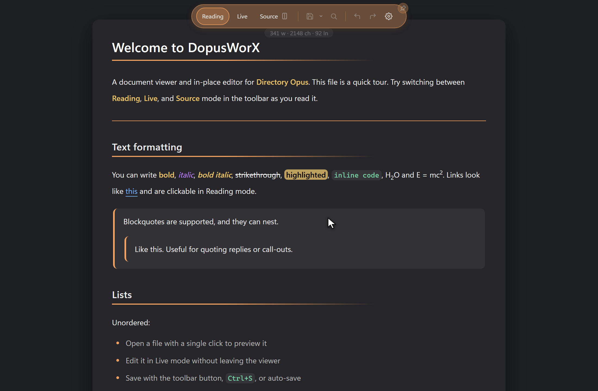
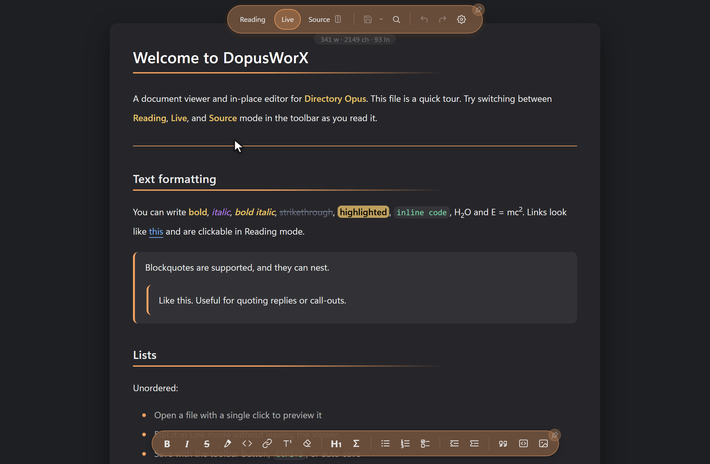
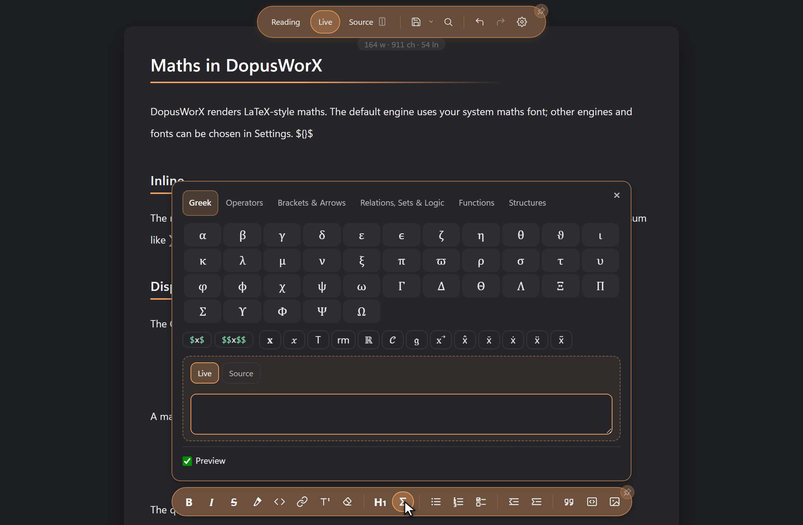
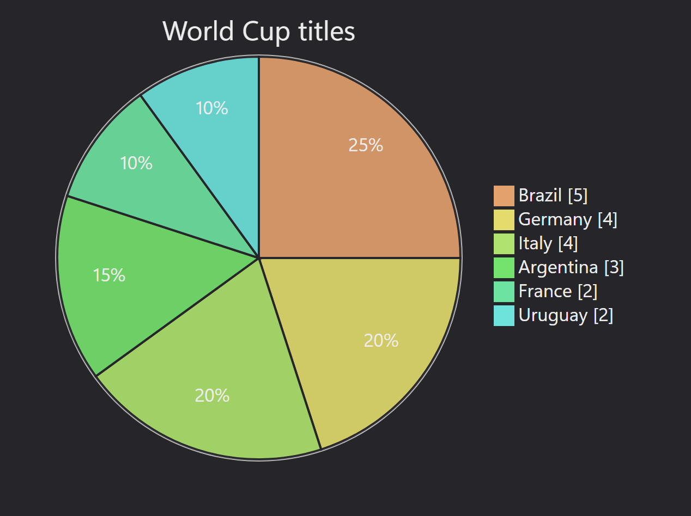
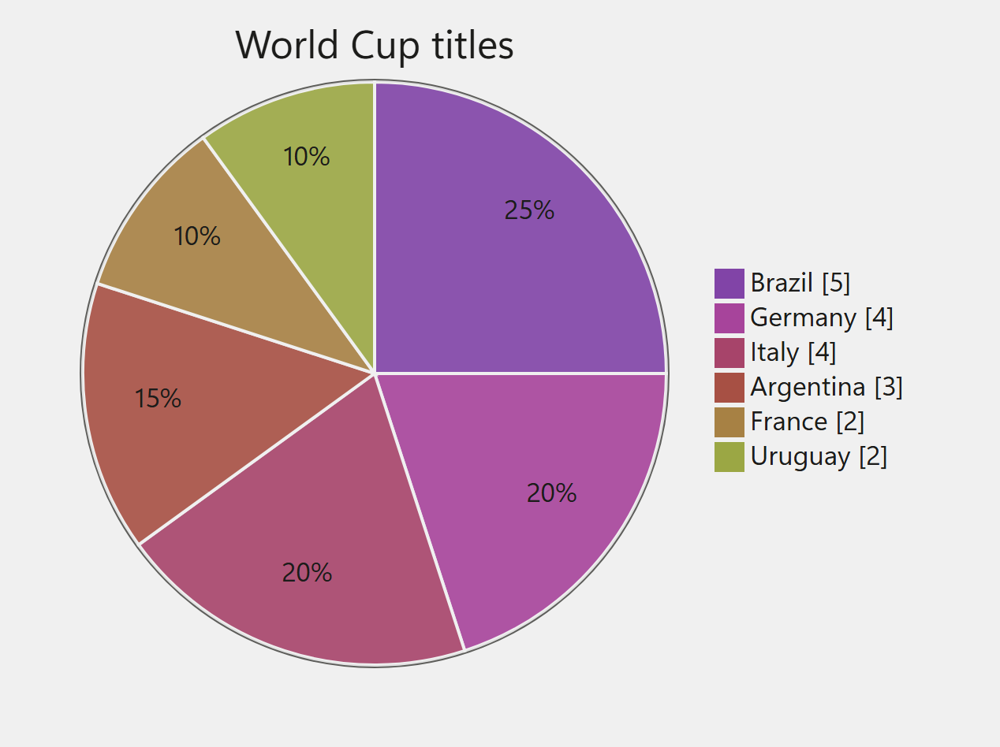
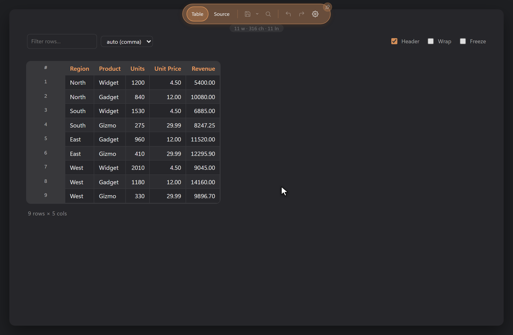
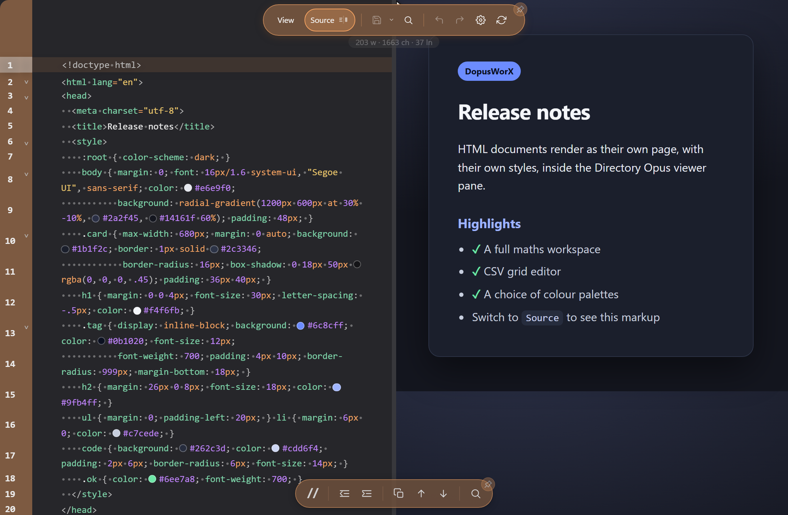
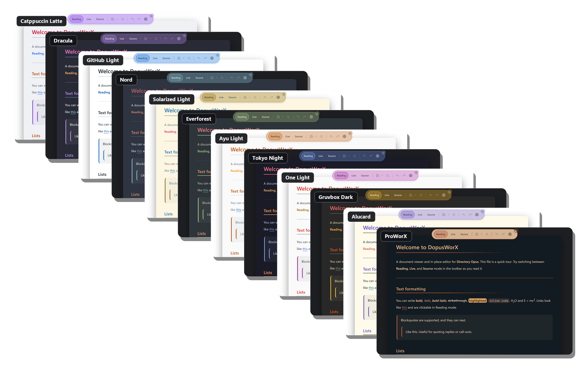

<div align="center">

# DopusWorX

**A document viewer and in-place editor that lives inside [Directory Opus](https://www.gpsoft.com.au/).**

Markdown, maths, diagrams, code, CSV, HTML and binary files, rendered and editable right in the Opus viewer pane.



Windows x64 &nbsp;·&nbsp; needs the Microsoft Edge WebView2 runtime &nbsp;·&nbsp; proprietary, © 2026 HyperWorX

</div>

---

DopusWorX grew out of mdWorX, and for this release it has been **completely
rewritten from the ground up** for a more robust and efficient design. It began
as a Markdown viewer and became a document workspace: a full maths workspace,
Mermaid diagrams that render by default, a binary and hex inspector with an
opt-in byte editor, more file types, more palettes, and much sturdier file
handling. It ships under its own name to match.

Get the plugin from the [Releases Page](https://github.com/HyperWorX/DopusWorX/releases)

---
<div align="center">
If DopusWorX brings value to your day and you appreciate the work behind it, you can...
</br>
</br>
<a href="https://www.buymeacoffee.com/HyperWorX" target="_blank"></a>

</div>

## What it is

A native Directory Opus viewer plugin: a Windows DLL that renders documents in
the Opus viewer pane and the pop-out viewer window. It is not a separate app. It
loads inside Opus and uses the Microsoft Edge WebView2 runtime to draw itself.

It is **file-type aware**: open a file and DopusWorX picks the right view for it.

- **Markdown** gets Reading, Live and Source, with a split preview.
- **Source-code** files open in Source view with syntax highlighting.
- **CSV / TSV** open as an editable grid.
- **HTML** renders as its own page, with a Source view and a split.

## Reading, Live and Source

For a Markdown document there are three ways to look at it:

- **Reading** is the finished, fully rendered page.
- **Live** renders the page too, but the moment your cursor lands on a line the
  formatting marks for that line come back, so you can edit without dropping out
  of the rendered view.
- **Source** is the raw text. Click Source a second time and it **splits**: raw
  on the left, live preview on the right, with a draggable divider you can slide
  to resize the panes, and a toggle to link or unlink their scrolling.

You pick which of these a Markdown file opens in under Settings (**Open markdown
in**: Reading, Live or Source). DopusWorX also remembers the view you last used
for each file, and you can keep that always, turn it off, or have it expire after
anything from five minutes to a year.

<table>
<tr>
<td width="50%"></td>
<td width="50%"></td>
</tr>
<tr>
<td align="center"><b>Reading</b></td>
<td align="center"><b>Live</b></td>
</tr>
</table>

**The split view.** Click Source a second time and the pane splits down the
middle: the raw Markdown on the left, the live preview on the right, with a
divider you can drag to resize the two panes and a button to link or unlink their
scrolling.

<div align="center"></div>

A full formatting toolbar sits underneath: bold, italic, strikethrough,
highlight, inline code, links, footnotes, a heading button that cycles H1 to H6,
bulleted, numbered and task lists, indent and outdent, blockquotes, fenced code,
image insert, and a table insert with a size grid. Find and replace handles case,
whole word and regex, and Ctrl+G jumps to a line. There is
undo and redo with a history dropdown, and a live word, character and line count.

A right-click menu is there throughout, and you do not need a mouse for it: open
it from the keyboard and the arrows move, Home and End jump, Enter or Space
activate, and Escape closes; on a touchscreen a press and hold opens it. See
[`docs/06-context-menus.md`](docs/06-context-menus.md) for the full set.

## Maths

- Write it in **LaTeX** or **AsciiMath**, inline with `$...$`, on its own line
  with `$$...$$`, or as an ```` ```am ```` block.
- **Auto-render** reads each equation on its own and works out which style you
  used, so you can mix the two in one note and not think about it.
- The **symbol panel (Σ)** lets you browse symbols by category and drop them in.
  It inserts in whichever style you are writing, so the same button types
  `\alpha` in LaTeX and `alpha` in AsciiMath.
- Click into a rendered equation and the source comes back; click away and it
  redraws. A live preview shows the equation under your cursor, and a convert
  button rewrites it from one style to the other in place.
- Slanted fractions (`\sfrac`, `\nicefrac`), eight maths fonts, and a choice of
  KaTeX or Temml as the engine.
- Define your own **macros**, either typed into Settings or kept in a file, so
  your usual shorthands work everywhere.

Prices are safe: `$5` stays as text, and `\$` gives you a literal dollar sign.
The maths engine only loads on notes that actually contain equations, so plain
notes stay quick. See [`docs/04-maths.md`](docs/04-maths.md) for the full guide.

<div align="center"></div>

## Diagrams

Turn a fenced ```` ```mermaid ```` block into a flowchart, sequence, class, state,
ER, pie or Gantt diagram, drawn from plain text with [Mermaid](https://mermaid.js.org/).
On by default; the ~3 MB engine loads only on a note that actually contains a
diagram.

- Diagrams draw in **Reading** and **Live**. In Live, click a diagram to bring its
  source back, edit it, and click away to redraw.
- **Match page** colours diagrams from your active palette, so they match the
  document and stay readable in light and dark. Or pin a fixed Mermaid theme.
- A **hand-drawn** style, a **flowchart edge** shape, a **diagram font** and
  **size** (the font can follow the body font or stand on its own), optional
  **label wrapping** and **sequence numbering**, and a **max-connections** guard
  for very large diagrams.
- A broken diagram shows a ⚠ box with its source and the reason, never taking the
  rest of the note down with it.

DopusWorX draws the diagram inline. With **Match page** the same diagram takes its
colours from the active palette, so it suits a dark page or a light one:

<table>
<tr>
<td width="50%"></td>
<td width="50%"></td>
</tr>
<tr>
<td align="center"><b>Dark palette</b></td>
<td align="center"><b>Light palette</b></td>
</tr>
</table>

See [`docs/08-mermaid.md`](docs/08-mermaid.md) for the full guide, with a live
example of every diagram type.

## Code and source files

Source-code files open in **Source view** (there is no Reading or Live mode for
code, since there is nothing to render).

- Syntax highlighting for around 150 languages (the common ones bundled, the
  rest loaded on demand), with a line-number gutter, a word-wrap toggle and a
  configurable tab width.
- A copy button, an optional active-line highlight (with a magnify option that
  lifts the line you are on), and a code-theme picker that is independent of the
  page palette.
- Colour values get a swatch and a colour picker, and diff and patch files colour
  their added and removed lines.

Fenced code blocks inside a Markdown document are highlighted in every Markdown
mode.

<div align="center"></div>

## Binary files

A file that is binary rather than text opens in a hex inspector: an offset / hex /
ASCII view with a side panel that reads the bytes under the cursor as integers and
floats. You can select byte ranges, jump to an offset, search for hex or text, and
copy as hex or text. An opt-in setting turns on byte editing, and any file can be
forced open with View as hex from the right-click menu. See
[`docs/09-binary-inspector.md`](docs/09-binary-inspector.md).

<div align="center"></div>

## CSV and tables

CSV and TSV open as an editable grid: click a header to sort, double-click a cell
to edit, add or delete rows with undo and redo, filter, freeze the first column,
override the delimiter, and copy the whole thing out as a Markdown table.

<div align="center"></div>

## HTML

HTML files have a rendered **View**, a **Source** view of the raw markup, and a
**split** that shows both at once.

<table>
<tr>
<td width="50%"></td>
<td width="50%"></td>
</tr>
<tr>
<td align="center"><b>Rendered view</b></td>
<td align="center"><b>View / Source split</b></td>
</tr>
</table>

## Themes and palettes

Thirty built-in palettes, dark and light, from Dracula and Nord to Catppuccin,
Everforest and Rosé Pine, alongside the signature ProWorX and GloWorX. By default
a palette follows the Opus pane background automatically; you can pin one instead.

<div align="center"></div>

Nothing is locked down. The visual editor lets you change any colour and save it
as your own named theme. Bold, italic, strikethrough and inline code each get
their own colour, headings can be coloured per level, and the page surface,
rules, borders and shadows are all yours to tune. See
[`docs/07-palettes.md`](docs/07-palettes.md) for a card of every palette.

## Markdown extras and Obsidian syntax

Full GitHub-flavoured Markdown: tables, task lists (tick the boxes in Reading or
Live), footnotes editable in place, definition lists, abbreviations,
mark/highlight, and sub/superscript.

Obsidian-style linking and embeds work too:

- `[[note]]` wiki-links, including `[[note#heading]]` and `[[note|alias]]`.
- `![[note]]` transclusion and `![[image.png]]` image embeds.
- The Obsidian image alt syntax for size and alignment: `` and
  ``. Relative paths and Windows absolute paths resolve.

## Customise it to your liking

The Settings dialog is organised into clear tabs, **Appearance**, **Content**,
**Toolbars**, **File types** and **About**, with live preview and a plain-language
note on each option. The **Content** tab groups its options by concern, Opening &
views, File reading & saving, Markdown rendering, Images, Code & source files,
Diagrams, then Maths. Among the things you can change:

- **Auto-hiding toolbars.** Set the top toolbar or the formatting toolbar to slide
  away and reappear when you reach for them, so the document gets the whole pane.
- **Toolbar layout.** Drag the formatting buttons into the order you want, or hide
  the ones you never use.
- **File types.** Decide which extensions DopusWorX handles. **Pane** previews a
  type in the viewer pane while browsing (double-click left alone); **DOpus** also
  opens it in the DopusWorX window on double-click inside Opus; **Explorer** also
  associates it with Windows so it opens from Explorer even when Opus is closed.
  A **Highlight Grammar** column sets which grammar each type uses, so you can
  open `.tpl` as C++ or map any type to any of the supported languages.
- **Maths macros**, fonts and engine, encoding and fallback codepage, image
  search folders, auto-save, separate left and right page margins, gutters,
  formatting marks, and the full type and colour controls behind the palettes.

## Robust and secure

A viewer that edits your files has to be careful with them, and a lot of the work
here went into exactly that.

- **Your edits survive.** Writes are atomic (a temp file, flushed, then a single
  atomic replace), so a file is never left half-written. An empty buffer will not
  overwrite a file that has content. If Opus closes or crashes with unsaved work,
  a recovery copy is kept under AppData and offered back when you reopen.
- **No silent overwrites.** If a file changes on disk while you are editing,
  DopusWorX notices, and tells the difference between a real change and a harmless
  touch by comparing the content, not just the timestamp. You get a clear choice:
  keep your edits, save a copy, or reload.
- **Remote images stay private.** Off by default, an image referenced by an
  `http(s)` URL renders as a placeholder and makes no network request at all, so a
  remote server cannot learn you opened a document that points at it.
- **A hardened updater.** The in-app updater talks HTTPS only, checks every
  redirect against an anchored allowlist of the real release hosts (so a
  look-alike domain gets nowhere), and refuses to install anything whose SHA256
  does not match the published hash.
- **Tidy on your system.** The viewer DLL writes no registry keys of its own; its
  settings, themes and cache all live under your profile.

## Staying up to date

DopusWorX checks for new releases from inside Settings and can fetch and install
an update for you, gated by the security checks above. Releases are published on
the [Releases page](https://github.com/HyperWorX/DopusWorX/releases).

## Documentation

For more detail than this page covers:

- [Getting started](docs/01-getting-started.md) - the basics, end to end.
- [File types and views](docs/02-file-types.md) - what each kind of file does, and how DopusWorX is file-type aware.
- [Editing](docs/03-editing.md) - the modes, the formatting toolbar, find and replace, and saving.
- [Maths](docs/04-maths.md) - LaTeX, AsciiMath, the symbol panel, fonts and macros.
- [Diagrams](docs/08-mermaid.md) - Mermaid flowcharts, sequence, class, state and more, plus the diagram settings.
- [CSV grids](docs/05-csv.md) - sorting, in-cell editing, filtering, freezing, delimiters and more.
- [Context menus](docs/06-context-menus.md) - the right-click menus, driven by keyboard or touch as well as mouse, and the Save menu.
- [Palettes](docs/07-palettes.md) - every built-in palette and the theme editor.
- [Binary inspector](docs/09-binary-inspector.md) - the hex view, the data inspector and the opt-in byte editor.

## Installation

1. Download the latest `DopusWorX_v<version>.zip` from the
   [Releases page](https://github.com/HyperWorX/DopusWorX/releases).
2. Quit Directory Opus.
3. Extract the zip and run **`Install.cmd`**, then accept the UAC prompt. It
   copies the plugin into the Directory Opus `Viewers` folder and relaunches
   Opus. **`Uninstall.cmd`** in the same zip removes it.

For an unattended or scripted update, `Install.cmd /silent` (and `Uninstall.cmd
/silent`, or the `/quiet` alias) run with no prompts.

**Requirements:** Windows x64, Directory Opus 12 or later, and the Microsoft Edge
WebView2 runtime. WebView2 is already on most up-to-date Windows installs; if it
is missing, DopusWorX shows a download link in the pane.

### Opening Markdown on double-click

Out of the box Opus opens a `.md` file with whatever Windows has associated. To
open it in the DopusWorX viewer instead, point the Markdown file type's *Left
double-click* event at the `Show` command under **Settings ▸ File types**
(covering `md markdown mdown mdwn mkd mkdn`). The File types panel in the
DopusWorX settings can set this up for you.

## Where your data lives

- Settings: `%APPDATA%\HyperWorX\DopusWorX\settings.json`
- Custom themes: `%APPDATA%\HyperWorX\DopusWorX\themes\<name>.json`
- WebView2 cache: `%LOCALAPPDATA%\HyperWorX\DopusWorX\`

## Try it

The [`samples/`](samples/) folder has sample documents. Start with
[`dopusworx.md`](samples/dopusworx.md), a single manual and exhibition of the
Markdown and maths features, then open the CSV, code, HTML and multilingual files
beside it so every view has something to show straight away.

---

<div align="center">

### Support

If you find this useful, you can buy me a coffee.

<a href="https://www.buymeacoffee.com/HyperWorX" target="_blank"></a>

</div>

## Licence

Proprietary. Copyright © 2026 HyperWorX. All rights reserved. See
[LICENSE](LICENSE).

Directory Opus is a trademark of GP Software. DopusWorX is an independent plugin,
not affiliated with or endorsed by GP Software.
