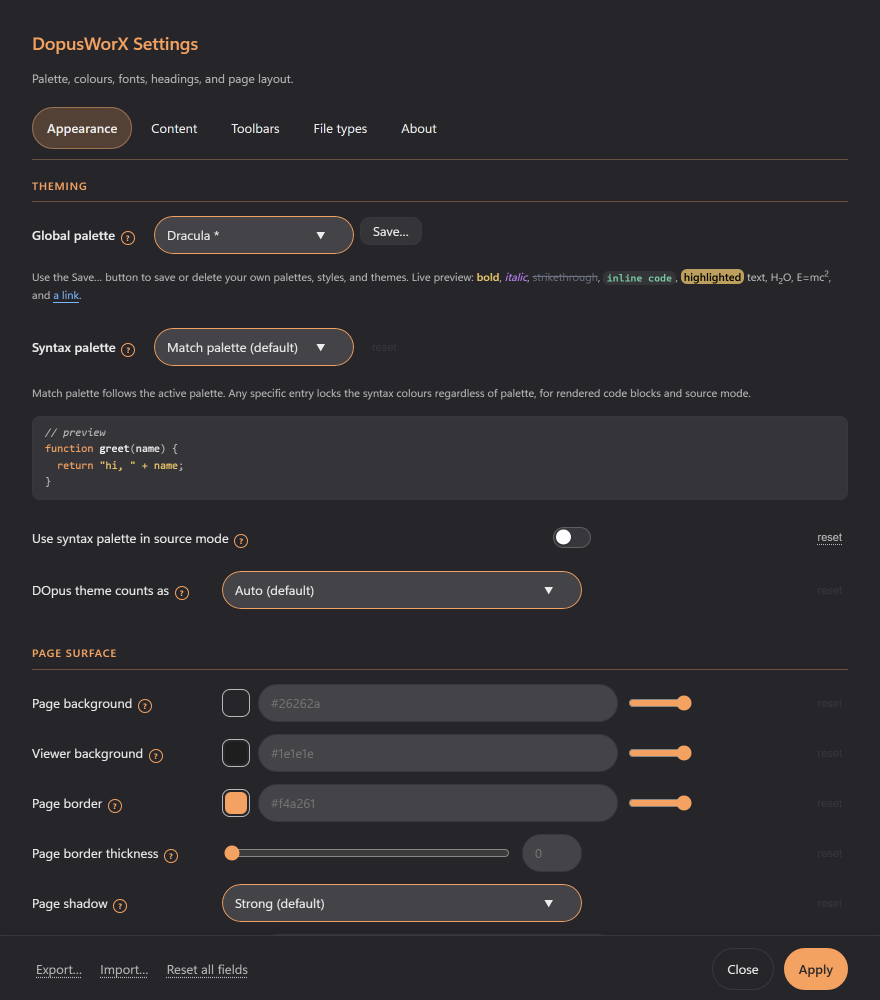

# Getting started

1. Install DopusWorX (see the main README), then open any supported file in the
   Directory Opus viewer pane or the pop-out viewer window. The pop-out window
   has a subtle translucent button in its top-right corner that toggles full
   screen -- the icon switches between expand and collapse arrows to show the
   current state. F11 does the same thing from the keyboard.
2. For a Markdown file, switch between **Reading**, **Live** and **Source** in the
   top toolbar. Click Source again for the split preview. You can set which of
   these a Markdown file opens in by default.
3. Edit in Live or Source and save with the toolbar Save button, or turn on
   auto-save. Save As and Save a Copy are on the Save menu. Turn on spell check
   in Settings if you want misspelled words underlined while you type.
4. Right-click anywhere for the context menu. It works with the mouse, the
   keyboard (arrow keys to move, Enter to choose, Escape to close) and a press
   and hold on a touchscreen. On a Markdown file it also offers Set banner image,
   which searches for a picture and sets it as the note's banner for you. Press
   **F1** at any time (or **?** in Reading mode) for the keyboard shortcut guide;
   it is also on the right-click menu.
5. Move between the files you have opened with the mouse back and forward buttons,
   or Ctrl+Alt+Left and Ctrl+Alt+Right, the same way a browser does.
6. Open **Settings** (the gear icon) to choose a palette, set fonts and spacing,
   pick the spell-check dictionaries, adjust the Mermaid diagram options, pick
   which view Markdown opens in, customise the toolbar, and map which file types
   open in DopusWorX. Changes take effect when you press **Apply**; if you close
   the dialog with changes you have not applied, it asks before discarding them.
   The one exception is the file-type grid: its tick boxes and custom types only
   take effect when you press **Apply file associations**, and any you have not
   applied are dropped quietly when you close. The **About** tab also has a
   **Check for updates** button; if a newer release is found, an **Install
   update** button appears -- click it and DopusWorX downloads, verifies, and
   installs the update for you, so you do not need to download the zip again.

## More

- [File types and views](02-file-types.md) - what each kind of file does.
- [Editing](03-editing.md) - modes, the formatting toolbar, find and replace, saving.
- [Maths](04-maths.md) - LaTeX, AsciiMath, the symbol panel and macros.
- [Diagrams](08-mermaid.md) - Mermaid flowcharts, sequence, class, state and more.
- [CSV grids](05-csv.md) - sorting, editing, filtering, freezing and more.
- [Context menus](06-context-menus.md) - the right-click menus, by mouse, keyboard or touch, and the Save menu.
- [Palettes](07-palettes.md) - the built-in palettes and the Appearance settings.
- [Binary inspector](09-binary-inspector.md) - the hex view, the data inspector and the opt-in byte editor.
