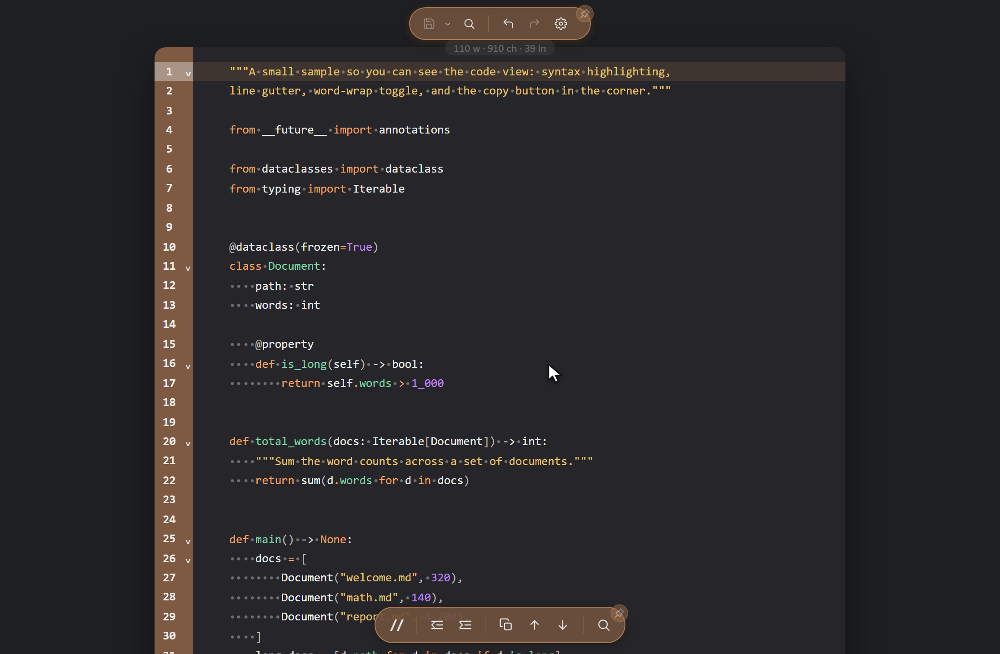
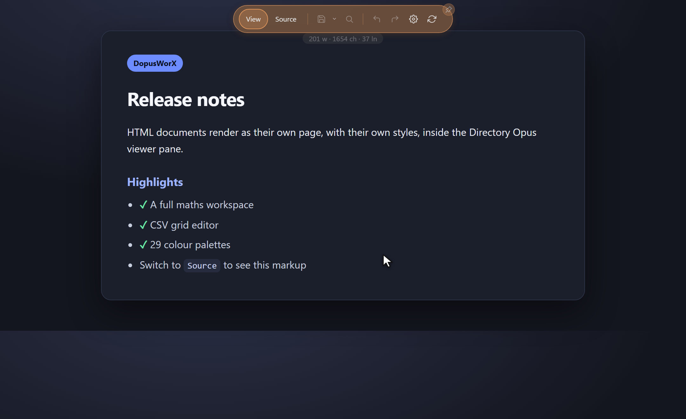

# File types and views

DopusWorX is file-type aware. When you open a file it works out what kind of
document it is and picks the right view, so you never land in a mode that makes
no sense for the content. A code file opens straight into an editable source
view; a Markdown file opens in Reading mode with Live and Source a click away; a
CSV opens as a grid; an HTML file renders as a page. This page documents exactly
which extensions map to which view and how each view behaves.

## How a file's kind is decided

Two layers cooperate.

The native plugin (the part that lives inside Directory Opus) decides a coarse
**kind** from the file extension when it loads the file. The logic is simple and
extension-first:

- the Markdown extensions become kind `markdown`
- `.html`, `.htm`, `.xhtml` become kind `html`
- anything else in the handled set becomes kind `code`
- a file with no extension falls back to `markdown`

The kind is sent to the web layer on the load message. The web layer then
applies one refinement of its own: if the path ends in `.csv` or `.tsv` it
rewrites the kind to `csv` so the file opens as the grid rather than as code.

Each kind resolves to a **format module** in the web layer's format registry.
The registry currently holds four modules: `markdown`, `code`, `html` and
`csv`. The module decides which view modes the toolbar offers, what their labels
are, how the read-only view renders, and which editor (if any) the editable
modes mount. An unknown kind falls back to the Markdown module.

## Handled extensions at a glance

These are the extensions DopusWorX claims out of the box, grouped by the view
they open into.

| View / kind | Extensions |
| --- | --- |
| Markdown | `.md` `.markdown` `.mdown` `.mkd` `.mkdn` `.mdwn` |
| HTML | `.html` `.htm` (the MIME and Source highlighter also recognise `.xhtml`) |
| CSV / TSV grid | `.csv` `.tsv` |
| Source code | everything in the language table below, plus `.json` `.xml` `.txt` `.log` |

JSON, XML, plain text and logs are not a separate kind: they resolve to the
`code` module and open in Source view, the same as any other code file. CSV and
TSV are in the plugin's handled set as well, but the web layer reroutes them to
the dedicated grid.

## Markdown

Extensions: `.md`, `.markdown`, `.mdown`, `.mkd`, `.mkdn`, `.mdwn`.

Markdown is the richest format. The toolbar offers three modes, defaulting to
Reading:

- **Reading** renders the document fully as read-only HTML. Task-list
  checkboxes are clickable here, and ticking one writes the `[ ]` / `[x]` back
  to its exact source line.
- **Live** renders the document too, but it is a live editor: the line your
  cursor sits on reveals its raw formatting marks so you can edit in place, the
  rest of the document stays rendered. This is the "Live Preview" style.
- **Source** is the raw Markdown text in a plain editor. Click the Source button
  a second time for a **split**: raw text on the left, a live preview on the
  right, with a draggable divider and a link / unlink toggle so the two panes
  can scroll together or independently.

Rendering runs Markdown through markdown-it with task lists, footnotes,
definition lists, abbreviations, marks, subscript / superscript, inline and
display maths (`$...$` / `$$...$$`), and Obsidian-style wikilinks and embeds.
Output is sanitised with a strict allowlist before it reaches the page.

Fenced code blocks inside a Markdown document are syntax-highlighted in **every**
Markdown mode (Reading, Live and Source's preview) using the same highlighter
that drives the standalone code view, so a fenced ` ```python ` block looks the
same wherever it appears.

## Source code

Code files open in **Source view only**. There is no Reading or Live mode for
code because there is nothing to render: source is its own presentation. The
toolbar shows no mode tabs for a code file, just the single Source surface.



Source view is a CodeMirror editor with syntax highlighting, a line-number
gutter (its style is configurable), word wrap, a copy button, colour swatches
next to colour literals, and a code-theme picker that is independent of the page
palette. The file is editable and saves through the same dirty / recovery / Save
pipeline as Markdown.

### Supported languages and extensions

DopusWorX highlights around 150 languages. The common ones in the table below are
built in and highlight instantly; the rest load on demand the first time you open
a file in that language, so the base viewer stays small. You can also choose the
grammar for any type yourself with the **Highlight Grammar** column in the File
types panel, so an extension that isn't listed (or one that means something
unusual to you) can be highlighted as whichever language you pick. Anything with
no grammar opens as plain text rather than failing.

| Language | Extensions |
| --- | --- |
| JavaScript | `.js` `.mjs` `.cjs` |
| JSX | `.jsx` |
| TypeScript | `.ts` |
| TSX | `.tsx` |
| Python | `.py` |
| Rust | `.rs` |
| Go | `.go` |
| C | `.c` |
| C / C++ (incl. headers) | `.h` `.hpp` `.hh` `.cc` `.cpp` `.cxx` |
| Swift | `.swift` |
| Java | `.java` |
| C# | `.cs` |
| Kotlin | `.kt` `.kts` |
| Scala | `.scala` |
| Dart | `.dart` |
| PHP | `.php` |
| R | `.r` |
| MATLAB / Octave | `.m` |
| Mathematica | `.nb` `.wl` `.wls` `.m` |
| Shell | `.sh` `.bash` `.zsh` |
| PowerShell | `.ps1` `.psm1` |
| Batch / CMD | `.bat` `.cmd` |
| Lua | `.lua` |
| Ruby | `.rb` |
| Perl | `.pl` `.pm` |
| SQL | `.sql` |
| JSON | `.json` |
| XML | `.xml` |
| YAML | `.yaml` `.yml` |
| TOML | `.toml` |
| INI / conf | `.ini` `.conf` |
| CSS | `.css` |
| SCSS | `.scss` |
| LESS | `.less` |
| HTML (Source) | `.html` `.htm` `.xhtml` |
| LaTeX | `.tex` `.latex` `.sty` `.cls` |
| Dockerfile | `.dockerfile` |
| Diff / patch | `.diff` `.patch` |

`.m` is shared: it can be MATLAB/Octave, Objective-C or a Mathematica package.
DopusWorX picks the right one from the file's content, so a MATLAB script and a
Mathematica package both highlight correctly. In the File types panel `.m` lives
on the MATLAB / Octave row, and you can pin it to a specific grammar there if you
only ever use one.

`.html`, `.htm` and `.xhtml` appear here too because they have a Source editor;
the difference is that the HTML kind also gives them a rendered View (see below).
A bare `.html` routed as code (rather than as the HTML kind) still gets HTML
highlighting in the editor.

### Diff and patch colouring

`.diff` and `.patch` files colour their added and removed lines so a patch reads
like one. The same diff highlighting applies to fenced ` ```diff ` blocks inside
Markdown.

### Minified and binary files

A large file with almost no line breaks (minified or single-line) and a file
that contains NUL bytes (binary) are not run through the live editor, which would
stall on them. They fall back to a static, read-only view: the minified file is
shown as raw text with a note that highlighting and editing are off; the binary
file shows a notice that it is not text.

## CSV and TSV

Extensions: `.csv`, `.tsv`.

These open as an editable grid (the "Table" view), with a raw editable Source
view alongside. In the grid you can sort by clicking a header, edit a cell by
double-clicking it, add or delete rows and columns with full undo / redo, select
cells, and copy out the selection, a cell, or the whole table as a Markdown
table. Edits flow back through the same dirty / recovery / Save path as every
other format, so saving writes the file. See [05-csv.md](05-csv.md) for the full grid
reference.


## HTML

Extensions: `.html`, `.htm` (`.xhtml` is recognised by the highlighter and MIME
layer).

HTML files have two modes:

- **View** renders the page in an isolated, sandboxed iframe, so it behaves like
  its own website with its own CSS and layout, free of the Markdown palette. A
  saved, unedited file loads the real document through a local virtual host, so
  its own relative stylesheets, scripts, images and fonts resolve from the
  file's folder. Unsaved edits render the live buffer with an injected base URL
  so relative resources still resolve. The rendered markup is sanitised:
  scripts, iframes, forms, inputs, event handlers and external link / base /
  meta tags are stripped.
- **Source** is the raw markup in a highlighted, editable editor.

Click Source a second time for a **split**: Source on the left, the rendered
page on the right. The split preview renders inline rather than through the
sandboxed iframe, reusing the same divider, drag and scroll-link machinery as
the Markdown split.

| Rendered View | View / Source split |
|:---:|:---:|
|  |  |

## JSON, plain text, logs and other kinds

JSON (`.json`) and XML (`.xml`) open in Source view with their respective
grammars highlighted. Plain text (`.txt`) and logs (`.log`) open in Source view
as plain text. None of these have a separate rendered mode; the editable source
is the view.

YAML, TOML, INI / conf, and every other entry in the language table follow the
same rule: Source view, highlighted where a grammar exists, editable, no
rendered mode.

## The File types settings panel

Settings has a **File types** tab that controls which types
DopusWorX handles and how they open. The panel lists one row per supported type
group (Markdown, HTML, plain text, and every code language), each with three
checkboxes:

- **Pane** - the type previews in the DopusWorX viewer pane while you browse.
  Double-click is left alone, so a script still runs on double-click. A newly
  added type takes effect after an Opus restart.
- **DOpus** - Pane, plus double-clicking the file inside Directory Opus opens it
  in the DopusWorX windowed viewer (no registry change).
- **Explorer** - DOpus, plus a Windows association so double-clicking the file in
  Windows Explorer opens DopusWorX even when Directory Opus is closed. This writes
  Windows Explorer associations and changes the system registry.

The three columns nest: Pane < DOpus < Explorer. Ticking a higher tier ticks the
ones below it, and unticking a lower tier clears the ones above it. Header
checkboxes apply the same rule to a whole column at once.

Each row also has a **Highlight Grammar** column: a dropdown that sets which
grammar that type opens with. It defaults to the type's own language and can be
set to any of the supported languages, so you can open `.tpl` as C++ or pick a
different grammar for any type. A grammar change is saved with the normal Apply
(it does not need Apply file associations), and a single "reset all" link puts
every row back to its default.

### Custom mappings

Below the built-in groups you can add your own extensions ("Add a file type,
e.g. `.tpl`"). A custom type folds into the handled set exactly like a ticked
built-in. It defaults to its matching grammar when the extension is a known
language, or to plain text otherwise, and you can change it any time with the
Highlight Grammar column. Like the column ticks, a newly added type only sticks
once you press **Apply file associations**. Footer Apply does not save it, so if
you close Settings having pressed only Apply (or nothing), the new row is gone
the next time you open it. You can add several at once separated by
commas, spaces or semicolons, and remove any custom row with its × button.

### Applying changes

The two save buttons commit different things:

- The main **Apply** at the bottom of Settings commits your **Highlight Grammar**
  picks, and those take effect straight away. It does **not** commit the Pane,
  DOpus or Explorer ticks, or any custom type you have added. Those stay visible
  while the dialog is open, but Apply does not save them, so they are gone the
  next time you open Settings. In other words they do not revert when you press
  Apply, they revert when you close Settings having pressed only Apply (or
  nothing).
- **Apply file associations** commits the Pane, DOpus and Explorer ticks and your
  custom types, writes the actual double-click handlers, and keeps your choices.
  This is the step that makes a column change or a new type stick across exits.

In short: change a grammar and press Apply; change a column or add a type and
press Apply file associations.

Both registry-touching actions are reversible. The first time DopusWorX touches
a type it captures your original setup, so unticking later restores it. A
separate **Back up registry...** button exports the affected keys to a folder you
choose without making any changes. Because applying associations restarts the
Opus integration, Directory Opus closes to apply and then asks whether to
restart.

The handled-extension list lives in `settings.json` under `fileAssociations`. Four
`;`-separated keys hold the extension lists - `handledExts`, `dblClickOpusExts`,
`dblClickWinExts` and `customExts` - and a fifth key, `langOverrides`, carries the
Highlight Grammar mappings. When the four extension-list keys are empty the settings
panel computes its display with every type ticked through the DOpus tier (enabled
with DOpus double-click), but the native C++ viewer itself handles Markdown only
until you press Apply file associations, which writes your real choices into these
keys.

### How the plugin claims types (the GUID claim)

DopusWorX registers with Directory Opus under a fixed plugin GUID
(`{74A3AE1F-C55E-4DAF-9107-F93E3A322CD8}`).

Opus copies a plugin's handled-extension list into a fixed-size buffer (measured
at 260 characters) that is far too small to hold every type DopusWorX supports,
and silently truncates the overflow. DopusWorX works around that by claiming
types through two channels at once:

- The **advertised extension list** it hands Opus is reordered so the
  highest-value types (Markdown, HTML, CSV / TSV, JSON, text) always lead and
  survive the truncation. This is an explicit claim, evaluated in Opus's first
  pass *ahead* of the built-in text viewer, which is what lets DopusWorX override
  the built-ins for those types.
- It also turns on **content identification** (`DVPFIF_CanHandleBytes`), so Opus
  additionally offers it every file and the plugin answers yes / no per file by
  matching the name's extension against its full in-code set (your `handledExts`
  setting, or the compiled default). This second channel claims every handled
  type the 260-character buffer dropped, plus any custom types you add, so
  nothing is lost to truncation.

DopusWorX is deliberately **not** a catch-all viewer. A catch-all plugin is
"called last" by the SDK, so Opus would only reach it after the built-in text
viewer had already claimed text-class types (`.json` / `.txt` / `.csv` / ...),
which is exactly what used to demote DopusWorX below `text.dll`. The explicit
claim above runs in the first pass instead. Types DopusWorX does not handle
return no from both identify paths and fall through to the Windows / Opus default
(the desired "unselected -> default"). The extension list is re-read on each Opus
plugin enumeration, so a File types change takes effect on the next Opus restart.

## Encoding and line endings

When a file is read, the encoding is resolved in this order: an explicit user
setting, then a BOM sniff, then strict UTF-8, then a configurable fallback
codepage.

- **BOM detection** recognises UTF-8, UTF-16 LE and UTF-16 BE byte-order marks
  and decodes accordingly.
- **Strict UTF-8** is tried for BOM-less files: it succeeds on pure ASCII or
  valid UTF-8 and refuses anything else, so bad input does not silently decode
  to replacement-character mojibake.
- **BOM-less UTF-16** is sniffed before the codepage fallback: such text is
  dense with NUL bytes on a consistent parity, which distinguishes LE from BE.
- **Fallback codepage** handles legacy 8-bit files when strict UTF-8 refuses
  them. It defaults to the system codepage and is configurable.

You can also pin the encoding explicitly. The `encoding` setting accepts `auto`
(the default), `utf-8`, `utf-16` / `utf-16le` / `utf-16be`, `system`, the
Windows codepages `cp1250` through `cp1258`, `iso-8859-1` / `iso-8859-2` /
`iso-8859-15`, and the CJK / Cyrillic codepages `shift-jis`, `gbk`, `big5`,
`euc-kr`, `koi8-r` and `koi8-u`. The `fallbackEncoding` setting takes the same
names (except `auto`) and is only consulted when `encoding` is `auto` and the
strict UTF-8 decode failed.

CJK, Arabic, Hebrew and other scripts render correctly throughout. The detected
encoding is remembered so a save round-trips it, including whether a UTF-8 file
had a BOM, and **line endings (LF / CRLF) are preserved on save**.
