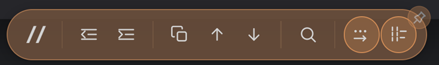
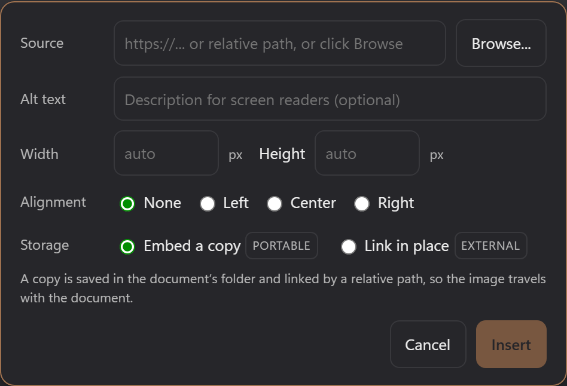
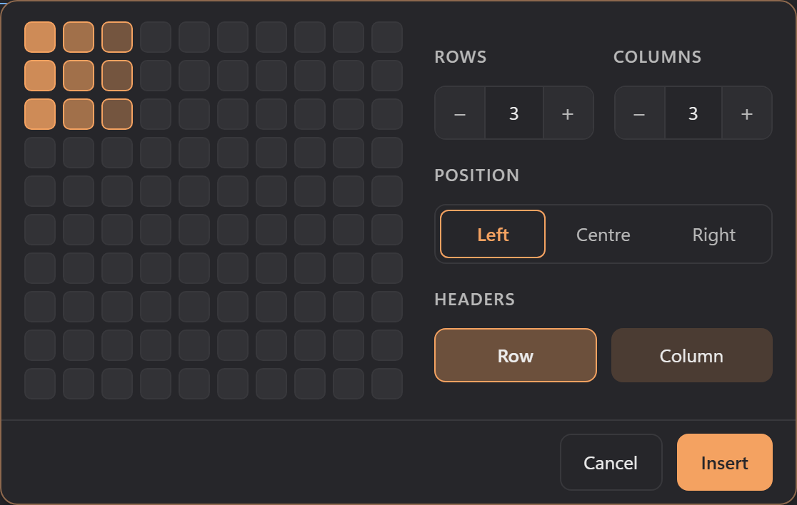
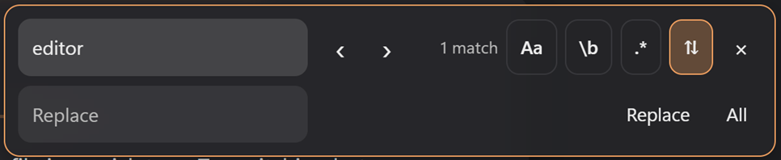

# Editing

DopusWorX is more than a previewer. You can read a file, write in it, and format it without leaving the pane. This page covers the three view modes, the formatting toolbar, the code-editing toolbar, inserting images and tables, wikilinks and embeds, find and replace, saving, the smaller comforts like undo, the live word count and zoom, and the keyboard shortcuts.

## The three modes

A file opens in one of three modes, picked from the buttons at the left of the top toolbar. You choose which view markdown opens in, and whether DopusWorX remembers the view you last used for each file; see [Which view a file opens in](#which-view-a-file-opens-in) below.

| Mode | What it is for |
|---|---|
| **Reading** | A clean, rendered, read-only view. This is what the document looks like finished. Task checkboxes are still clickable here, and ticking one writes `[ ]` to `[x]` back to the source line. |
| **Live** | An editor that looks like the rendered output as you type, the way Obsidian's Live Preview works. Click into a line and the raw markdown markers for that line appear so you can change them; click away and the line renders again. |
| **Source** | A plain-text editor showing the raw markdown (or raw code) with syntax highlighting and nothing hidden. The power-user surface. |

Click **Reading**, **Live** or **Source** in the toolbar to switch between the modes. Not every file kind offers all three. Code and text files always open as an editable Source view; markdown gives you all three.

### Which view a file opens in

Two settings decide the mode a markdown file lands in. Both live in Settings, under Opening & views.

- **Open markdown in** sets the default view: Reading (the default), Live or Source. A file opens in this view whenever its remembered view is not used.
- **Remember each file's view** decides whether a file reopens in the view you last used for it, and for how long. Keep it on with Always (the default), turn it Off so every file opens in the default view, or pick a duration from five minutes up to a year. With a duration the last view comes back only if you reopen the file within that window, counted from the last time you opened it; once the window lapses the file falls back to the default view.

### Raw HTML and aligned blocks in Live

Live shows raw HTML blocks the way Reading does, rather than leaving them as visible tags. A self-contained block such as a `<details>` box, a `<mark>` or an `` renders in place. Put the cursor on it and the raw source comes back so you can edit it; click away and it renders again. Wrapper tags on their own line, like a bare `<div>` or `</div>`, simply disappear.

Alignment carries across too. A block centred with a `<div align="center">`, a `<center>` element or a `text-align` style centres its content, including whole tables, in Live as well as Reading. Left, right and justify alignment work the same way. In Source mode the HTML stays exactly as you wrote it.

### The Source split preview

The Source button has a small pane icon on it. Click Source once to enter Source mode; click it again to toggle a **split preview**: the raw source on the left, the rendered document on the right, side by side. Click once more to drop back to a single pane. The split state is remembered per file for the session.

<div align="center"></div>

While the split is open:

- **Drag the divider** between the two panes to resize them. The split holds between 15% and 85% so neither pane can be squeezed to nothing.
- **Linked scrolling** is on by default. Scroll either pane and the other follows in step (a ratio match, not line-for-line, since prose and monospace source do not line up exactly). The link button sits on the divider; the chain icon shows whether scrolling is linked.
- **Click the chain button to unlink.** The icon switches to a broken chain and the two panes scroll independently. Click it again to relink.

### Folding heading sections

In Live and Source you can fold a markdown heading's whole section down to the next heading of the same or a higher level, so you can collapse the parts you are not working on.

- **Source** shows a fold gutter beside the line numbers. Click a fold arrow to collapse or expand the section under that heading.
- **Live** keeps the same fold gutter, dimmed until you hover it, and also puts a small accent chevron in the left margin of each H1 to H3 heading, shown when you hover the heading. Click either to fold or unfold; the chevron rotates to show the state and stays clickable while folded, so you can open the section back up. A folded section collapses to accent-coloured **...** dots after the heading - click the dots to unfold.

Folding is a view convenience only. It never changes the document.

## The formatting toolbar

The formatting toolbar runs along the bottom of the pane in Live and Source mode for markdown files. Each button either wraps your selection in markdown or adds a prefix to the lines you have selected. With nothing selected, the wrapping buttons drop the markers in and park the cursor between them so you can start typing.

You can rearrange the toolbar to suit you: **Edit toolbar layout** in Settings, under Toolbars, lets you drag buttons sideways to reorder them, click one to hide or show it, and Reset to put the default set back.

<div align="center"></div>

### Inline formatting

| Button | Produces | Notes |
|---|---|---|
| **Bold** | `**text**` | |
| **Italic** | `*text*` | |
| **Strikethrough** | `~~text~~` | |
| **Highlight** | `==text==` | |
| **Inline code** | `` `text` `` | |
| **Link** | `[text](url)` | Asks for the URL. If your selection already looks like a link it is used as the label; otherwise `link text` is dropped in and selected for you. |
| **Footnote** | `[^N]` at the cursor, plus a matching `[^N]: ` definition at the end of the document | `N` is the lowest free number, so deleting a footnote frees its number for reuse. The cursor lands in the new definition so you can type the note straight in. See [Footnotes](#footnotes) below for editing them. |
| **Clear formatting** | strips everything back to plain text | Works on the selection, or the current line if nothing is selected. It removes line prefixes (heading `#`, blockquote `>`, list and task markers, indentation, stacked or nested), inline markers (`**`, `*`, `~~`, `==`, `` ` ``), link and image syntax (keeping the visible text), and any stray inline HTML pasted from another app. Single underscores are left alone so `snake_case` survives. One undo reverses it. |

The common inline wraps also have keyboard shortcuts in markdown Live and Source: **Ctrl+B** bold, **Ctrl+I** italic, **Ctrl+Shift+C** inline code and **Ctrl+Shift+X** strikethrough. They do exactly what the matching buttons do.

### Headings and maths

| Button | What it does |
|---|---|
| **Heading (H)** | Cycles the heading level of the current line. The number on the button shows what the next click will apply. A plain line becomes H1; an existing heading steps up one level, wrapping H6 back to H1. Moving the cursor to another line re-reads that line's level. The button always sets a level rather than removing it; to drop a heading, delete the `#` or undo. |
| **Sigma (Σ)** | Opens the maths symbol panel. The button is present whenever maths rendering is on, which it is by default, and disappears only if you turn maths off in settings. See the maths page for what the panel does. |

### Lists

| Button | Produces |
|---|---|
| **Bulleted list** | `- ` on each selected line (click again to remove) |
| **Numbered list** | `1. `, `2. `, `3. ` down the selected lines, renumbered in sequence (click again to remove) |
| **Task list** | `- [ ] ` on each selected line, preserving any indent so it works inside nested lists (click again to remove) |

With the cursor on a list line, **Tab** indents it and **Shift+Tab** outdents it, the same two-space step as the indent buttons below.

### Indent

| Button | What it does |
|---|---|
| **Increase indent** | adds two spaces to the front of each selected line |
| **Decrease indent (outdent)** | removes up to two leading spaces from each selected line |

### Blocks

| Button | Produces |
|---|---|
| **Blockquote** | `> ` on each selected line (click again to remove) |
| **Fenced code block** | a ```` ``` ```` fence around the selection, or an empty fence with the cursor on the body line. The fence always starts and ends on its own line so it parses cleanly. |
| **Insert image** | opens the image popup (below) |
| **Insert table** | opens the table size grid (below) |

## The code-editing toolbar

When you open a code or text file in Source mode, the formatting toolbar is replaced by a code-editing toolbar. These commands are language-agnostic and run CodeMirror's own editing commands, so they behave exactly like the editor itself.

<div align="center"></div>

| Button | What it does |
|---|---|
| **Toggle comment (`//`)** | comments or uncomments the current line or selection, using the comment syntax of the file's language. A no-op on languages with no comment token. |
| **Outdent** / **Indent** | decrease or increase the indent of the selected lines |
| **Duplicate line** | copies the current line below itself |
| **Move line up** / **Move line down** | shifts the current line past its neighbour |
| **Find** | opens the editor's search panel |

## Inserting an image

The image button (in the formatting toolbar) opens a small popup so you can place an image without hand-writing the markdown.

<div align="center"></div>

- **Source** can be a local file path or an `http(s)` URL. Type or paste it, or click **Browse** to pick a file from disk.
- **Alt text** is the description used by screen readers. Optional.
- **Width** and **Height** are optional pixel values. Leave either blank for automatic sizing; you can set just one.
- **Alignment** is None, Left, Center or Right. None inserts plain markdown with no wrapper.
- **Storage** is the choice that decides whether the image travels with your document. It has two options, and a line under it explains what the current choice will do:
  - **Embed a copy** (the default) brings the image in beside the document and links it by a relative path, so it stays self-contained. For a local file this copies it; for a URL it downloads it. This is the safe choice: a copied-in image always shows, including after you close and reopen the file.
  - **Link in place** points the document at the file where it already sits, without copying. This is an external reference, the same kind of thing as a web URL or a hand-written `` tag: it does not travel with the document, and it only resolves while the original file stays put. Use it when you would rather not duplicate a shared image library.

  For a web URL, Link in place keeps the URL and needs **Allow remote images** turned on in settings; with that off, Link is disabled and the choice is forced to Embed (downloaded), because an unresolved external URL would just show as a placeholder.

Insert is enabled as soon as the Source field has text. The popup writes Obsidian-style image markdown, for example ``, which renders at the right size and alignment both here and in Obsidian. Click outside the popup, or its close control, to close it.

You can write the same syntax by hand anywhere: `` sets a width, `` width and height, `` a height alone, and a trailing `|left`, `|center` or `|right` aligns the image. The Obsidian embed form takes the same sizes: `![[img.png|420]]` (see [Wikilinks and embeds](#wikilinks-and-embeds)).

### How local images are found

When a document references a local image, DopusWorX looks for it in this order:

1. **Beside the document**, by the relative path written in the markdown. This is where Embed a copy puts things, and it is the most portable: move the document and its folder together and the images come along.
2. **In your image search folders**, if it was not found beside the document. The **Also look for images in** setting (Settings, default `attachments`) names extra folders to check, separated by `;`. Each entry is relative to the document folder, such as `attachments` or `../assets`, and absolute paths such as `D:\vault\attachments` work too. Each folder is tried with the image's full relative path first, then with its bare filename, which is how Obsidian resolves its uniquely-named pasted images.
3. **At its absolute path**, for an image linked in place (or any document that already stores a `C:\...` path). These keep working across restarts: opening a document re-establishes which outside folders its own images live in, so a linked image does not go blank after you reopen the file or restart Directory Opus.

For safety, the viewer only ever serves images from folders your open document points at or that you pick yourself, and it never serves from the Windows system folder. A document cannot make it read files it does not reference.

## Inserting a table

The table button (in the formatting toolbar) opens a small grid. Move the pointer over it to pick the size, up to 8 columns by 8 rows, with the current choice shown as "N × M". Click to drop a markdown table at the cursor: the first row is the header, with the separator row beneath it, and the cursor lands in the first cell ready to fill in. Click outside the popup, or press Escape, to close it without inserting.

<div align="center"></div>

### Images in table cells

You can put a sized, aligned image in a table cell. Two ways, and you can mix them
in one table:

- **Obsidian pipe syntax**, the same one [Inserting an image](#inserting-an-image)
  writes: `` for width, `` for width and height,
  and add an alignment to centre it in the cell, ``. Use the
  plain pipe; you do **not** need to escape it inside the cell.
- **HTML**, ``, which is handy if you prefer to set the
  height too or already have HTML to hand.

A column can also be centred the normal markdown way, with a `:---:` separator, so
its cells (image or text) centre as a column.

How it works: a bare `|` is normally the cell separator, so the viewer recognises
the `` image span and treats the pipes inside it as part of the
image, not as new columns. Your source file keeps the plain pipe exactly as you
typed it; the handling is only for rendering.

What breaks it: the image has to be a single, well-formed `` span on
the line. A stray `]` or `)` inside the alt text or the path, an unclosed bracket,
or a real line break in the middle will end the span early and the rest spills into
the next column. If a cell ever splits oddly, fall back to the HTML `` form,
which has no pipes to confuse the table.

### Table options

A comment on the line directly above a table gives it options markdown cannot
express:

```
<!-- dwx-table: center, header-col -->
| Name | Value |
|---|---|
| one  | 1 |
```

The flags, in any combination separated by commas:

| Flag | Effect |
|---|---|
| `center` | centres the table on the page |
| `right` | pushes the table to the right edge |
| `header-col` | shades the first column like a header, for tables whose rows are labelled down the side |
| `no-header` | renders the header row as a plain data row, for tables that have no titles |

The directive works in Reading and Live alike, and the comment itself renders to
nothing. Other markdown apps simply show a normal table, so a file that uses it
stays portable.

Wrapping a table in an alignment container does the same job for position: a
table inside `<div align="center">` (or `<center>`) centres the table itself, not
just the text in its cells, exactly as the `center` flag does, and a right-aligned
wrapper matches `right`. This is what the right-click Alignment menu writes when
you use it on a table (see [06-context-menus.md](06-context-menus.md)).

## Table of contents

Right-click an editable markdown document and choose Insert &rsaquo; Table of Contents to drop a contents list at the top, under a leading H1 title if the document has one, otherwise below any frontmatter. Choose it again to refresh the list.

The block sits between two hidden `<!-- toc -->` markers and keeps itself in step: add, remove, rename or reorder a heading and the list updates on its own, so it never drifts from the document. Each entry links to its heading.

Two settings under Settings &rsaquo; Appearance &rsaquo; Table of contents set the look, and both update an existing TOC in place:

- **List style**: Numbered (1. 2. 3.) or Bulleted.
- **Title style**: No title, Classic (bold with a rule), Styled (small caps with a top rule), Accented (an accent bar) or Coloured (an accent banner).

## Frontmatter and the banner image

A markdown file can open with a YAML frontmatter block: a `---` fence, some `key: value` lines, then a closing `---`, before any content. DopusWorX recognises it and keeps it out of the rendered document, rather than showing the `---` as a horizontal rule and the keys as stray text.

- **Reading** hides the block.
- **Live** hides it too, until you put the cursor in it, when the raw YAML comes back for editing (the same cursor-on-line behaviour as fenced code and maths). Move away and it hides again.
- **Source** shows the frontmatter as written.

One key is special: **`banner:`** takes an image path or URL and renders that image as a banner strip across the top of the document, above the first heading, in Reading and Live. It resolves local paths the same way inline images do (see [How local images are found](#how-local-images-are-found)).

## Wikilinks and embeds

DopusWorX reads Obsidian's double-bracket references:

- **`[[note]]`** is a wikilink. `[[note|shown text]]` changes the display text, and `[[#Heading]]` links to a heading in the same document - click it to scroll there. A link into another document renders as a styled reference but is not followed.
- **`![[note]]`** embeds (transcludes) another note's content into the document in Reading mode, and `![[note#Section]]` embeds just that section. An embed that cannot be resolved says why in place - a file that cannot be read, a section not found, or a circular embed - rather than breaking the page.
- **`![[image.png]]`** embeds an image. Add a size after a pipe: `![[image.png|240]]` for a width, `![[image.png|240x180]]` for width and height.

In Live mode wikilinks render as styled references and note embeds show as compact chips; put the cursor on one and the raw source comes back for editing.

## Footnotes

Footnotes attach a note or citation to a point in the text. The **Footnote** button on the formatting toolbar adds both halves at once: a `[^N]` marker where the cursor is, and a matching `[^N]: ` definition at the end of the document. The number is the lowest free one, so if you delete a footnote its number comes free again and the next one you add reuses it instead of always climbing.

You edit a footnote in its real place in the document, the same way Live mode handles every other block. There is no separate pop-up box, so what you type is the markdown and Reading, Live and Source always agree.

- **In Live mode** the definitions sit at the bottom as a tidy footnotes section. Click a footnote (or arrow into it) and its raw source opens for editing; click away and it renders again. After inserting, the cursor is already in the new definition so you can type straight away.
- **Multi-line footnotes**: press Enter inside a footnote to continue it on a new line, indented so it stays part of the same note. Press Enter on a blank line to finish the footnote.
- **An empty footnote** shows a "click to add text" placeholder, so you can always reopen one you left blank and fill it in later.
- **To remove a footnote**, use the small delete control on it. That removes the definition and every `[^N]` reference to it in one go.
- **Jumping around**: click a footnote number in the text to go to its note, and the return arrow on the note to go back to the reference. Both centre the target in the view rather than pinning it to the top.
- **In Reading mode** footnotes render at the bottom with the same numbered links and return arrows, and those links work too.

In Source mode you write footnotes by hand as plain markdown: a `[^id]` marker in the text and a `[^id]: text` definition at the end, with any continuation lines indented four spaces. The id can be a number or a word like `[^note]`; either way it shows as a number in Reading and Live.

## Find and replace

The magnifier button on the top toolbar, or **Ctrl+F**, opens the find and replace panel. Find works in every mode: in Live and Source it searches the editor, and in Reading it searches the rendered page, with the count showing your position ("2 / 5"). Replace needs an editor, so the Replace row is available in Live and Source only. (In code Source mode, the code toolbar's Find button opens the editor's own search instead.)

<div align="center"></div>

- Type in the **Find** field. The match count shows beside it live ("3 matches", "no matches", or "bad regex" if a regular expression will not compile). If you had a single line selected when you opened the panel, it seeds the Find field for you.
- **Enter** jumps to the next match and **Shift+Enter** to the previous, the same as the **‹** and **›** arrows. Each match is scrolled to the centre of the view so it is always in sight.
- Three toggles change how Find matches:
  - **Aa** - match case
  - **\b** - match whole word
  - **.\*** - treat the Find text as a regular expression
- The panel opens as find-only. The **⇅** toggle reveals the Replace row when you want it, so Enter always means "next match" and can never replace something by accident. (Opening the panel from the right-click menu's Find / Replace item reveals the row straight away.)
- With Replace open, **Replace** changes the current match; **All** replaces every match at once. Enter in the Replace field also replaces the current match. The count updates after each replace.

Click the close control (or press Esc) to dismiss the panel; the match highlights clear with it. On a narrow pane the panel's controls wrap onto a second line so it always fits.

## Go to line

Press **Ctrl+G** in any editor surface - markdown Live or Source, and code files in View or Source - to open the Go to line popup. It opens seeded with the current line; type a line number (within the document's length) and press Enter, or click Go, to jump to that line and centre it. The same action is on the right-click menu as Go to line. (In the [binary inspector](09-binary-inspector.md), Ctrl+G jumps to a byte offset instead.)

## Saving

The save button is the split control near the left of the top toolbar: the main half saves, the caret beside it opens the rest of the save options.

- **Save** (the main button) writes your changes back to the file. It does nothing if there is nothing to save.
- **Save As** (from the Save menu) writes to a new file and switches the pane to it. It works even with no unsaved changes, so you can duplicate a file under a new name.
- **Save a Copy** writes the current content to a path you pick without changing the file you are editing. It is an export: the pane stays on the original, the dirty marker is untouched.

The same menu also holds export options: **Export as HTML** for markdown, **Export as Plain text** for code, and **Print / Save as PDF** for any file (which prints the rendered Reading view, so it captures the whole document, not just the lines on screen).

Your original file's encoding and line endings are preserved on save. A file with mixed line endings keeps them line by line; a uniform file keeps its convention.

### Auto-save

Auto-save is off by default and set in minutes in settings. When on, it saves on that interval but only if there are unsaved changes, and it never truncates a file to empty (only a deliberate manual save of an empty document can do that).

### Refresh (reload from disk)

Ctrl+R or F5 reloads the file from disk, in any mode, not just Reading. If you have unsaved edits it asks before discarding them, so a refresh never quietly throws away your work. This is the way to pick up a change another program made to the file while you had the viewer open. (HTML files also get a refresh button on the top toolbar, for reloading the rendered View; other kinds use the keys.)

### If the file changes underneath you

Your unsaved work is never silently dropped. Whenever two versions of a file are in play, a banner appears and stays until you choose. The message and buttons fit the case:

- **Unsaved edits from last time.** Reopen a file you edited without saving and the banner offers **Keep my edits** (carry on where you left off), **Save a copy & reload** (write your edits to a timestamped copy beside the file, then load the disk version) or **Discard and reload**.
- **Unsaved edits in another window.** If another DopusWorX window holds unsaved edits for the same file, the banner says so and offers **Use those edits here** (adopt them and carry on), **Save a copy & reload** or **View disk version**. Viewing the disk version never touches the other window's edits; they stay safe in that window.
- **Edits here and a change outside.** If you have unsaved edits and the file also changed on disk or in another window, **Keep my edits** keeps your version and makes your next save win; **Discard and reload** takes the disk version.
- **A save lost the race.** If a save finds the disk copy changed first, **Keep my edits** saves your version over it; **Discard and reload** takes the disk version.
- **No local edits, new content elsewhere.** If your copy is clean and the file changed on disk or was saved by another window, the banner asks whether to **Reload** or **Keep current view**.

Every Keep or Discard shows a brief toast with an **Undo** button that brings the banner back so you can choose again.

If you would rather never see the reopen banner, turn on **Always reload external changes** in Settings, under File reading & saving: the disk version is then always used. Save before you close - with this on, unsaved edits from a previous session are not offered back.

## Smaller comforts

### Undo and redo

The undo and redo buttons on the top toolbar step through your edit history. **Hold** either button for about half a second to open a list of recent states. Each entry leads with what the step did and a quoted snippet of the text it touched - Cut "Some words…", Paste "the new paragraph…" - plus how much the document grew or shrank (+120, −45) and how long ago. Click an entry to jump straight back to that state instead of stepping one edit at a time. The list keeps up to 40 recent states per file.

### Live word count

A small pill under the top toolbar shows the document's word, character and line counts as you type. Select text and it switches to the selection's character and word count, with the full document figures in the tooltip. Turn **Show document stats** off in Settings, under Toolbars, to hide it.

### Auto-hiding toolbars

Each toolbar can either stay put or slide out of the way. The pushpin on the corner of a toolbar toggles it: pinned means always visible, unpinned means auto-hide. When a bar is hidden, move the pointer to the edge where it lives and it slides back in. The choice is saved and applies to every open pane. The same pair of choices lives in Settings, under Toolbars, as **Top toolbar display** and **Edit toolbar display**.

### Zoom

Hold **Ctrl and scroll the mouse wheel** to zoom the document in or out, from 50% to 300%. A small pill shows the level as you go. Each mode keeps its own zoom, and opening a different file resets to 100%. A trackpad pinch zooms too, with the toolbars staying pinned at their normal size while the document scales behind them.

### Wrapping long lines in code

Two settings control how long lines of code behave, separately for the two surfaces. Both are in Settings, under Code & source files.

- **Wrap long lines in code blocks** (on by default) governs rendered code blocks in Reading and Live. On, a long line wraps to the pane width; off, each block scrolls horizontally on its own.
- **Wrap long lines in source** (on by default) governs the Source editor. On, long lines reflow to the pane width; off, the editor scrolls horizontally and keeps column alignment.

### Magnifying the active row

In Source and code editing the line your cursor is on lifts slightly toward you, so it is easy to see where you are working. It is on by default; turn **Magnify active row** off in Settings, under Code & source files, for a flat view. It does not apply in Live mode. A related toggle in the same section, **Highlight active row** (also on by default), tints the current line and its line number together as one accent band.

### Formatting characters and whitespace

Source view marks spaces with faint dots and tabs with arrows out of the box; **Show whitespace dots in Source** (Settings, under Code & source files) turns that off. **Show formatting characters** (Settings, under Markdown rendering) goes further: it adds a line-ending badge (LF or CRLF) to each line and shows the whitespace marks in Live mode too, not just Source.

### Single newlines as line breaks

Standard markdown joins lines separated by a single newline into one paragraph. If you want a newline in the source to be a visible line break in Reading and Live (the way chat apps and some note tools treat it), turn on **Render single newlines as line breaks** in Settings, under Markdown rendering.

## Keyboard shortcuts

| Keys | What they do |
|---|---|
| **Ctrl+E** | Cycle through the view modes |
| **Alt+Left / Alt+Right** | Step backward / forward through the view modes (markdown and HTML) |
| **Alt+Up** | Open the split preview, switching to Source first if needed |
| **Alt+Down** | Close the split |
| **Ctrl+S** | Save |
| **Ctrl+Shift+S** | Save As |
| **Ctrl+F** | Find (all modes) |
| **Ctrl+G** | Go to line (a byte offset in the binary inspector) |
| **Ctrl+R / F5** | Reload from disk |
| **Ctrl+P** | Print / Save as PDF |
| **Ctrl+B / Ctrl+I** | Bold / italic (markdown Live and Source) |
| **Ctrl+Shift+C / Ctrl+Shift+X** | Inline code / strikethrough (markdown Live and Source) |
| **Tab / Shift+Tab** | Indent / outdent the current list line |
| **Ctrl+mouse wheel** | Zoom |
