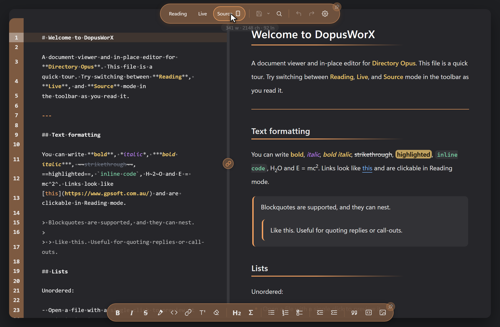
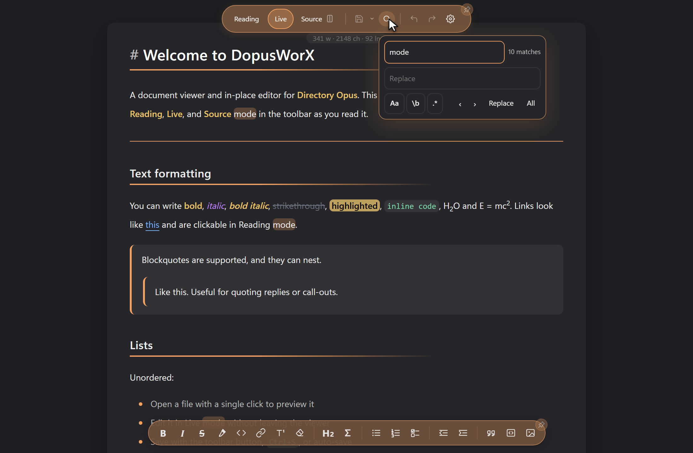

# Editing in DopusWorX

DopusWorX is more than a previewer. You can read a file, write in it, and format it without leaving the pane. This page covers the three view modes, the formatting toolbar, the code-editing toolbar, inserting images, find and replace, saving, and the smaller comforts like undo, the live word count and zoom.

## The three modes

A file opens in one of three modes, picked from the buttons at the left of the top toolbar. DopusWorX remembers which mode you last used for a file and reopens it that way.

| Mode | What it is for |
|---|---|
| **Reading** | A clean, rendered, read-only view. This is what the document looks like finished. Task checkboxes are still clickable here, and ticking one writes `[ ]` to `[x]` back to the source line. |
| **Live** | An editor that looks like the rendered output as you type, the way Obsidian's Live Preview works. Click into a line and the raw markdown markers for that line appear so you can change them; click away and the line renders again. |
| **Source** | A plain-text editor showing the raw markdown (or raw code) with syntax highlighting and nothing hidden. The power-user surface. |

Click **Reading**, **Live** or **Source** in the toolbar to switch between the modes.


Not every file kind offers all three. Code and text files always open as an editable Source view; markdown gives you all three.

### The Source split preview

The Source button has a small pane icon on it. Click Source once to enter Source mode; click it again to toggle a **split preview**: the raw source on the left, the rendered document on the right, side by side. Click once more to drop back to a single pane. The split state is remembered per file for the session.



While the split is open:

- **Drag the divider** between the two panes to resize them. The split holds between 15% and 85% so neither pane can be squeezed to nothing.
- **Linked scrolling** is on by default. Scroll either pane and the other follows in step (a ratio match, not line-for-line, since prose and monospace source do not line up exactly). The link button sits on the divider; the chain icon shows whether scrolling is linked.
- **Click the chain button to unlink.** The icon switches to a broken chain and the two panes scroll independently. Click it again to relink.

## The formatting toolbar

The formatting toolbar runs along the bottom of the pane in Live and Source mode for markdown files. Each button either wraps your selection in markdown or adds a prefix to the lines you have selected. With nothing selected, the wrapping buttons drop the markers in and park the cursor between them so you can start typing.

### Inline formatting

| Button | Produces | Notes |
|---|---|---|
| **Bold** | `**text**` | |
| **Italic** | `*text*` | |
| **Strikethrough** | `~~text~~` | |
| **Highlight** | `==text==` | |
| **Inline code** | `` `text` `` | |
| **Link** | `[text](url)` | Asks for the URL. If your selection already looks like a link it is used as the label; otherwise `link text` is dropped in and selected for you. |
| **Footnote** | `[^N]` at the cursor, plus a `[^N]: ` stub at the end of the document | `N` is the next free number. In Live mode the footnote's edit box at the bottom of the document opens so you can type the note straight away; in Source mode the cursor jumps to the new definition. |
| **Clear formatting** | strips everything back to plain text | Works on the selection, or the current line if nothing is selected. It removes line prefixes (heading `#`, blockquote `>`, list and task markers, indentation, stacked or nested), inline markers (`**`, `*`, `~~`, `==`, `` ` ``), link and image syntax (keeping the visible text), and any stray inline HTML pasted from another app. Single underscores are left alone so `snake_case` survives. One undo reverses it. |

### Headings and maths

| Button | What it does |
|---|---|
| **Heading (H)** | Cycles the heading level of the current line. The number on the button shows what the next click will apply. A plain line becomes H1; an existing heading steps up one level, wrapping H6 back to H1. Moving the cursor to another line re-reads that line's level. The button always sets a level rather than removing it; to drop a heading, delete the `#` or undo. |
| **Sigma (Σ)** | Opens the maths symbol panel. This button only appears once maths rendering is switched on in settings. See the maths page for what the panel does. |

### Lists

| Button | Produces |
|---|---|
| **Bulleted list** | `- ` on each selected line (click again to remove) |
| **Numbered list** | `1. `, `2. `, `3. ` down the selected lines, renumbered in sequence (click again to remove) |
| **Task list** | `- [ ] ` on each selected line, preserving any indent so it works inside nested lists (click again to remove) |

### Indent

| Button | What it does |
|---|---|
| **Increase indent** | adds two spaces to the front of each selected line |
| **Decrease indent (outdent)** | removes up to two leading spaces from each selected line |

### Blocks

| Button | Produces |
|---|---|
| **Blockquote** | `> ` on each selected line (click again to remove) |
| **Fenced code block** | a ```` ``` ```` fence around the selection, or an empty fence with the cursor on the body line. The fence always starts and ends on its own line so it parses cleanly. |
| **Insert image** | opens the image popup (below) |

## The code-editing toolbar

When you open a code or text file in Source mode, the formatting toolbar is replaced by a code-editing toolbar. These commands are language-agnostic and run CodeMirror's own editing commands, so they behave exactly like the editor itself.

| Button | What it does |
|---|---|
| **Toggle comment (`//`)** | comments or uncomments the current line or selection, using the comment syntax of the file's language. A no-op on languages with no comment token. |
| **Outdent** / **Indent** | decrease or increase the indent of the selected lines |
| **Duplicate line** | copies the current line below itself |
| **Move line up** / **Move line down** | shifts the current line past its neighbour |
| **Find** | opens the editor's search panel |

## Inserting an image

The image button (in the formatting toolbar) opens a small popup so you can place an image without hand-writing the markdown.

- **Source** can be a local file path or an `http(s)` URL. Type or paste it, or click **Browse** to pick a file from disk.
- **Alt text** is the description used by screen readers. Optional.
- **Width** and **Height** are optional pixel values. Leave either blank for automatic sizing; you can set just one.
- **Alignment** is None, Left, Center or Right. None inserts plain markdown with no wrapper.
- **Copy file to this document's folder** brings the image in beside the document so the file stays self-contained. For a local file this copies it; for a URL it downloads it. If "Allow remote images" is off in settings, this box is ticked and locked for URLs (an external reference would otherwise be blocked and show as a placeholder); with remote images allowed, URLs tick it by default but you can untick it to keep the link.

Insert is enabled as soon as the Source field has text. The popup writes Obsidian-style image markdown, for example ``, which renders at the right size and alignment both here and in Obsidian. Click outside the popup, or its close control, to close it.

## Find and replace

The magnifier button on the top toolbar opens the find and replace panel. (In code Source mode, the code toolbar's Find button opens the editor's own search instead.)



- Type in the **Find** field. The match count shows beside it live ("3 matches", "no matches", or "bad regex" if a regular expression will not compile). If you had a single line selected when you opened the panel, it seeds the Find field for you.
- Type a replacement in the **Replace** field.
- Three toggles change how Find matches:
  - **Aa** - match case
  - **\b** - match whole word
  - **.\*** - treat the Find text as a regular expression
- The up and down arrows (**‹** and **›**) jump to the previous and next match.
- **Replace** changes the current match; **All** replaces every match at once. The count updates after each replace.

Click the close control to dismiss the panel.

## Saving

The save button is the split control near the left of the top toolbar: the main half saves, the caret beside it opens the rest of the save options.

- **Save** (the main button) writes your changes back to the file. It does nothing if there is nothing to save.
- **Save As** (from the Save menu) writes to a new file and switches the pane to it. It works even with no unsaved changes, so you can duplicate a file under a new name.
- **Save a Copy** writes the current content to a path you pick without changing the file you are editing. It is an export: the pane stays on the original, the dirty marker is untouched.

The same menu also holds export options: **Export as HTML** for markdown, **Export as Plain text** for code, and **Print / Save as PDF** for any file (which prints the rendered Reading view, so it captures the whole document, not just the lines on screen).

Your original file's encoding and line endings are preserved on save. A file with mixed line endings keeps them line by line; a uniform file keeps its convention.

### Auto-save

Auto-save is off by default and set in minutes in settings. When on, it saves on that interval but only if there are unsaved changes, and it never truncates a file to empty (only a deliberate manual save of an empty document can do that).

### If the file changes underneath you

If a file is reopened with unsaved edits and it has also changed on disk (or in another window), or a save finds the disk copy changed first, a banner appears and stays until you choose. Your unsaved work is never silently dropped. Depending on the case, the choices are:

- **Keep my edits** - keep your version. For an external change this makes your next save win.
- **Save a copy & reload** - write your unsaved edits to a timestamped copy beside the file, then load the disk version.
- **Discard and reload** - drop your edits and load the disk version. A brief **Undo edits** toast lets you take this back if it was a mis-click.

## Smaller comforts

### Undo and redo

The undo and redo buttons on the top toolbar step through your edit history. **Hold** the undo or redo button for about half a second to open a list of recent states, labelled by what each step did (Typing, Paste, Cut, Indent and so on) and how long ago, so you can jump straight back to an earlier point instead of stepping one edit at a time.

### Live word count

A small pill under the top toolbar shows the document's word, character and line counts as you type. Select text and it switches to the selection's character and word count, with the full document figures in the tooltip.

### Auto-hiding toolbars

Each toolbar can either stay put or slide out of the way. The pushpin on the corner of a toolbar toggles it: pinned means always visible, unpinned means auto-hide. When a bar is hidden, move the pointer to the edge where it lives and it slides back in. The choice is saved and applies to every open pane.

### Zoom

Hold **Ctrl and scroll the mouse wheel** to zoom the document in or out, from 50% to 300%. A small pill shows the level as you go. Each mode keeps its own zoom, and opening a different file resets to 100%. A trackpad pinch zooms too, with the toolbars staying pinned at their normal size while the document scales behind them.
