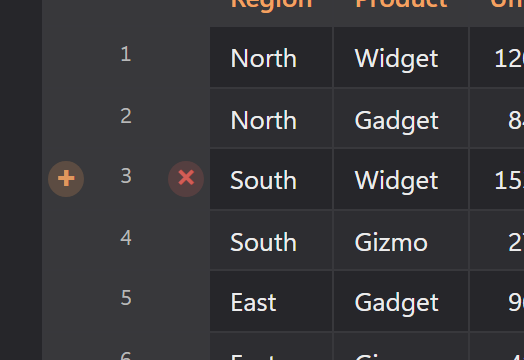
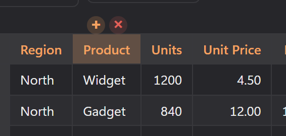

# CSV grids

Open a `.csv` or `.tsv` file and DopusWorX shows it as a spreadsheet-style grid instead of raw text: a proper table with a sticky header, sortable columns, in-cell editing, and a row-number gutter down the side. It is built for reading and light editing of tabular data without leaving the viewer.

Edits write straight back to the file when you save. The grid never reorders or drops rows behind your back: sorting and filtering only change what you see, not what gets written.

## Opening a file

CSV and TSV files open in the grid automatically. The delimiter is detected from the first non-empty line (it picks whichever of comma, semicolon, tab or pipe occurs most), so a tab-separated `.tsv` and a comma-separated `.csv` both just work. Quoting follows the usual rules: quoted fields, doubled `""` for a literal quote, and commas or line breaks inside quotes are all handled, so a cell can contain the delimiter or span several lines without breaking the table.

Ragged rows are padded out to the widest row, so every row shows the same number of columns even if the file has short lines.

## The controls bar

A thin bar sits above the grid. On the left are the filter box and the delimiter dropdown; on the right are three toggles: **Header**, **Wrap** and **Freeze**. Under the grid, a status footer shows the row and column count on the left and the row-cap notice (when it applies) on the right.

## Sorting

Click a column header to sort by it. Each click cycles through three states:

1. First click: ascending
2. Second click: descending
3. Third click: back to unsorted (original file order)

The sorted column shows an arrow indicator in its header. Sorting is smart about numbers: a column of numbers sorts numerically (thousands separators like `1,234.5` are understood), numbers sort ahead of text in a mixed column, and text sorts in natural order so `item2` comes before `item10`.

Sorting is view-only. The underlying rows stay in their original file order, and that is the order written when you save. Sort, scroll, read, then save, and the file on disk is untouched in its row order. The sort is stable, so rows that compare equal keep their original relative order.

## First row as header

The **Header** toggle controls whether the first row is treated as column titles. It is on by default.

- **On**: the first row becomes the sticky header, and the body starts at row 2. The header cells are editable (see below).
- **Off**: the first row is treated as ordinary data, and the columns get generic letter names (A, B, C, ...) like a spreadsheet.

Toggling Header clears any active sort, since the row that was the header is now a body row (or the other way around).

### Editing the header row

When Header is on, the header cells are editable. Single-clicking a header still sorts, so to edit a title you double-click it. Click another cell or click away to commit the change.

## Editing cells

Body cells are editable in place. To start editing a cell, double-click it.

Clicking another cell or clicking away from the cell you are editing commits the change. To discard an edit, commit it and then use Undo to restore the original value. Editing writes directly into the data, so a sort or filter applied afterwards keeps your edit, and a save reflects it.

## Adding and deleting rows

There are a couple of ways to add a row:

- **Hover the row-number gutter** and a small **+** appears at the left of the gutter. Click it to insert a blank row above that row (the row you hovered moves down).
- Right-click a body row and use the **Insert** submenu to add a blank row above or below it. You can also press **Ctrl+Enter** in any body cell to insert a row below it.
- To add several rows at once, use **Insert > Add rows...** in the right-click menu.

To delete a row, hover its gutter cell and click the **✕** that appears. The grid always keeps at least one row, so the last remaining row cannot be deleted.

## Adding and deleting columns

Hover a column header and a small floating **+ / ✕** control appears just above it (clicking the header itself sorts, so the control surfaces on hover, the same way the row buttons do).

- **+** adds a blank column to the right of that column.
- **✕** deletes that column.

The right-click menu also lets you insert a column to the left or right of the clicked cell, or add several at once via **Insert > Add columns...**

The grid always keeps at least one column, so the last column cannot be deleted. If you delete the column you were sorting by, the sort is cleared; user-set column widths move along with their columns when you insert or delete.

## Undo and redo

The undo and redo buttons in the toolbar work on the grid. Hover one and its tooltip names the change it will reverse (for example, "Undo delete column").

Every change to the data is undoable: cell edits, row inserts and deletes, column inserts and deletes. Undo and redo restore the data and any column widths you have set; the sort and filter you have applied stay where they are. The history holds up to 100 steps. Starting a new edit after undoing clears the redo stack, as you would expect.

## Filtering

The **Filter rows** box hides any row that does not contain the text you type, matched as a plain substring anywhere in the row, case-insensitively. Filtering is view-only: hidden rows are still in the file and are still written on save. When a filter is active, the footer shows how many rows match out of the total (for example "120 of 5,000 rows"). Clear the box to bring every row back.

## Wrap long cell text

By default, text that is too long for its cell is clipped with an ellipsis. Turn on the **Wrap** toggle to wrap long cell text onto multiple lines within the cell instead.

## Freeze first column

Turn on the **Freeze** toggle to keep the first data column pinned in place while you scroll the grid sideways. Useful when the first column is a label or key you want to keep in view as you read across a wide table.

## Delimiter override

The delimiter is auto-detected, and the dropdown shows what was detected (for example "auto (tab)"). If detection gets it wrong, pick the right one from the dropdown:

| Option | Delimiter |
|---|---|
| auto | detect from the file (default) |
| comma | `,` |
| semicolon | `;` |
| tab | tab |
| pipe | `\|` |

Changing the override re-parses the current contents, including any edits you have already made, so your edits survive the switch. The active sort is cleared on a delimiter change, and later saves use the delimiter you chose. Your choice is remembered per file, so the same file reopens with the delimiter you picked.

## Numeric columns

A column whose values are all numbers (sampled from the top of the file) is automatically right-aligned, the way numbers line up in a spreadsheet. Empty cells are ignored when deciding, and a column needs at least one number to count as numeric. The alignment is decided from the file's own rows, so it does not flicker as you filter.

## Row cap for large files

To keep the grid responsive, at most 5,000 rows are rendered at once. If a file (or a filtered view) has more than that, the footer shows a notice like "Showing the first 5,000 of 12,000 rows. Edit in Source for the rest." The rest of the data is still there and is still saved; only the on-screen rendering is capped. Narrowing the view with the filter can bring the visible count back under the cap, at which point the notice clears.

## Tooltips on long cells

A cell whose text is long (more than 40 characters) or contains a line break gets a hover tooltip showing its full value, so you can read a clipped cell without widening the column or turning on wrap.

## Copying

Right-click anywhere in the grid to open the menu. The **Copy** submenu offers four options: **Selected cells** (appears only when you have a block selected -- copies them as tab-separated text laid out as on screen), **Cell** (the value of the clicked cell), **Table as Markdown** (the current view, respecting any filter and sort, as a pipe-delimited Markdown table with pipes and newlines inside cells escaped), and **Document (CSV source)** (the raw file text). Clicking the **Copy** parent item directly copies any native text selection, or the raw source if nothing is selected. For the full list of grid menu actions see [06-context-menus.md](06-context-menus.md#csv-and-tsv-table-view).

Select cells by clicking one, **Shift+click** to extend a rectangle from the anchor, or **Ctrl+click** (Cmd+click on a Mac) to toggle individual cells -- unless the cell contains a web address, in which case Ctrl+click opens it in your browser instead. The copied block reads from the current view, so it matches what is on screen under any sort or filter.

## Pasting

Paste drops clipboard text into the grid, either with **Ctrl+V** or the **Paste** item in the right-click menu. The paste starts at the top-left corner of the current selection, or at the focused cell if no block is selected.

- A copied block of cells (tab-separated rows, the same shape Copy writes) lands as a range, filling cells from the target down and across.
- A single value pasted over a multi-cell selection fills every selected cell in that selection.
- Pasting stays inside the existing grid, so it never adds rows or columns: anything that would fall past the edge is dropped.
- A paste is undoable in one step, like any other change to the data.

## Resizing columns and rows

Columns start in automatic layout, sized to their contents. Drag the grip on a column header's right edge to set a column's width; the first drag switches the table to a fixed layout seeded from the current widths, so nothing jumps. Drag the grip on the bottom edge of a row's gutter cell to set that row's height. Column widths and row heights are remembered per file, and row heights follow their rows through sorting and filtering.

## Remembered zoom

Zoom a CSV table (hold **Ctrl** and turn the mouse wheel, or use the **Zoom** item in the right-click menu) and DopusWorX remembers the level for that file. Reopen the file and the grid comes back at the zoom you left it. The zoom is kept per file, so each table keeps its own level.

## Printing

**Print** in the right-click menu, or in the Save menu, prints the whole table,
not the screenful you can see. It carries whatever filter and sort the grid is
showing, and repeats the column headings at the top of every sheet. Under the
same entry, **Black and white** does the same on a plain sheet with none of the
palette on it. Printing from Source prints the raw text of the file
instead of the table.

## A note on what gets saved

Saving writes the data back in the file's original row order, with its original line endings, byte-order mark and trailing newline preserved, so an open-and-save with no edits leaves the file byte-for-byte the same. When you do edit, only fields that need it are quoted (anything containing the delimiter, a quote or a newline), with inner quotes doubled. The delimiter written is the one in use: the detected one, or your override if you set one.
