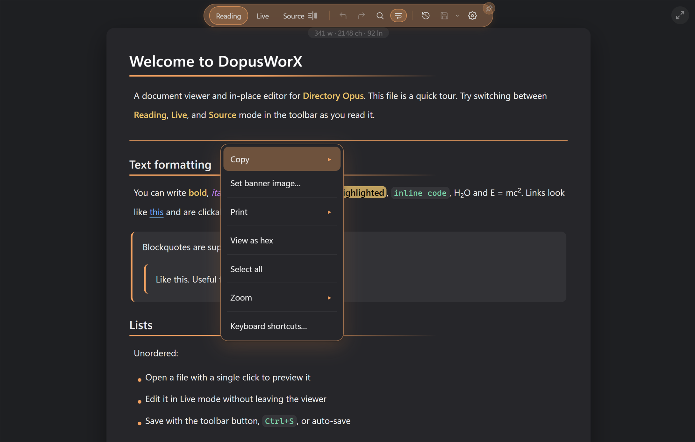
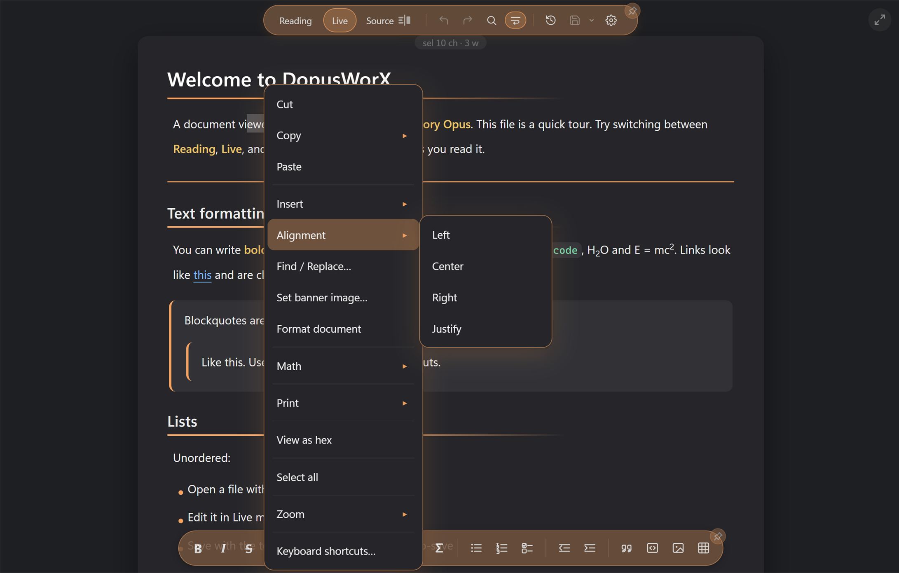
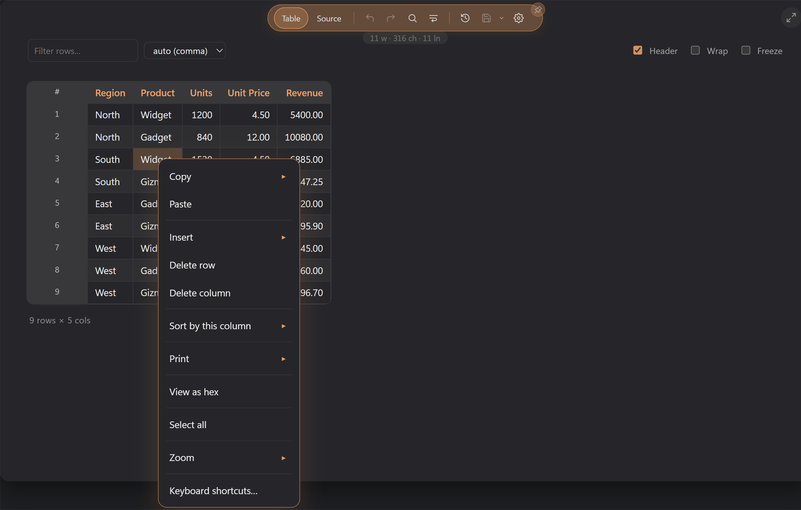
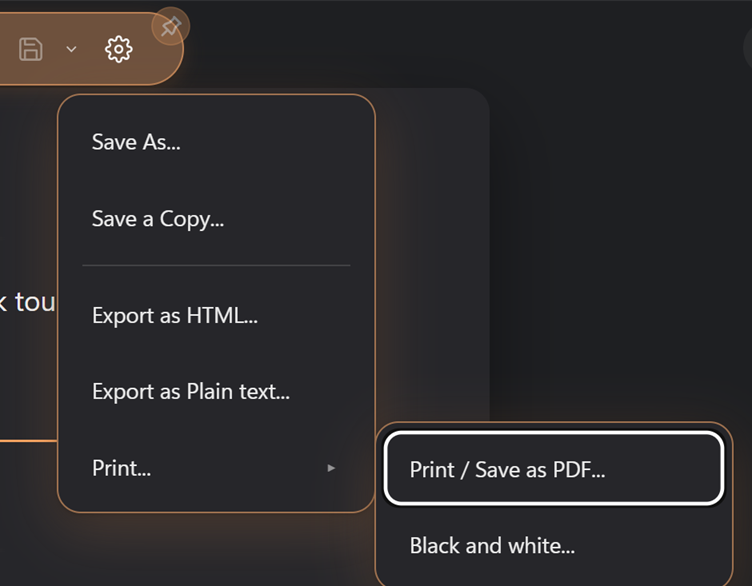

# Context menus

Right-click anywhere in a DopusWorX pane and you get its own menu, built for what you clicked on. The toolbar at the top carries a Save button with its own drop-down for the export and print actions. This page covers both.

The viewer turns off the WebView2 browser menu on purpose, so the menu you see is always the DopusWorX one, never the generic browser entries. Everything below is what actually appears.

## The right-click menu

The menu is built fresh on every right-click, so it only ever lists actions that apply to where you clicked. Two things decide what you get:

- The **mode** you are in: Reading, Live, or Source.
- The **file kind**: a Markdown document, a code or text file, or a CSV / TSV table.

Live, Source, and a code file's Source view are editable surfaces. Reading is read-only, so the editing items (Cut, Paste, Insert, Alignment, Find / Replace) are held back there.

### Markdown and document views

These are the items you can see, roughly top to bottom. Not all show at once.

- **Spelling suggestions.** At the very top, only when you right-click a word the spell checker has underlined (spell check on, an editable Markdown surface). Up to five corrections; click one to replace the word. See Spell check in [03-editing.md](03-editing.md).
- **Cut.** Only when you are on an editable surface and have text selected.
- **Copy.** Always present. Click it to copy straight away (the selection if you have one, otherwise the whole document source). Hover the arrow for the longer list:
  - **Selection**, when text is selected.
  - **Table as CSV**, when you right-click a table. Copies that table as CSV, with proper quoting; a task-checkbox cell becomes its `x` / empty state plus any label.
  - **Document as Markdown** copies the raw Markdown source.
  - **Document as HTML** copies the rendered HTML.
  - **Document as Rich text** copies it as formatted rich text, so it pastes with its styling into Word and the like.
  - **Document as Plain text** strips the markup and copies just the words.
- **Paste.** Editable surfaces, and the CSV table view (where it pastes into the grid at the target cell).
- **Insert.** Editable Markdown only. A submenu that gathers the things you drop into a document:
  - **Image...** opens the same image dialog as the editing toolbar's image button. The submenu is Markdown-only because it writes a Markdown image line ``, which is inert anywhere else. Code, HTML, CSV and even LaTeX / TeX source editors do not show it: LaTeX is prose-like for maths but uses `\includegraphics`, not Markdown image syntax.
  - **Table...** opens the same table dialog as the editing toolbar's table button (size grid or Cols × Rows, table position, header row and header column).
  - **Table of Contents** drops a contents block at the top of the document, or refreshes the one already there. It sits between two hidden markers and keeps itself in step as you add, remove or rename headings, so it never goes stale. Its title and numbering follow the Table of contents settings (see [03-editing.md](03-editing.md)).
- **Alignment.** Editable Markdown only. A submenu of **Left**, **Center**, **Right** and **Justify** that aligns the selection, the table under the caret, or the current line. It wraps the block in an alignment container that renders the same in Reading, Live and export. On a table the wrapper moves the table itself, not just the text in its cells, the same as the table directive's `center` and `right` flags (see Table options in [03-editing.md](03-editing.md)). Picking a new alignment replaces the existing one rather than stacking wrappers; picking the block's current alignment again removes it, and **Left** (the default) always removes it - a clean toggle, never a nest.
- **Find / Replace...** Editable surfaces only. Opens the find panel with the Replace row already showing. In a read-only view use Ctrl+F or the toolbar magnifier instead: find works in every mode, only the menu item is held back.
- **Set banner image...** Markdown documents, in any mode. Opens a search box; type a word, press Enter, and click a result to set it as the note's banner image (it writes the `banner:` frontmatter for you). It searches Wikimedia Commons by default, with Openverse on its own tab beside it, and falls back to Openverse automatically if Commons is unreachable. Set an Unsplash Access Key in Settings to add Unsplash as a third tab; an Openverse key is optional and only lifts its rate limit. See Set banner image in [03-editing.md](03-editing.md).
- **Go to line...** Source views only - markdown Source, and a code file's Source view - where lines are the visible unit. It opens a small popup; type a line number and press Enter (or click Go) to jump to that line and centre it. Ctrl+G does the same and also works in Live, but the menu leaves the item out there since Live renders blocks and a line number means nothing.
- **Format document.** Code files DopusWorX has a formatter for (JSON today), where it pretty-prints the file - the fix for a minified one-line file - and Markdown documents in Live and Source, where it gives the source a conservative tidy-up. Either way it is a normal edit: it marks the file dirty and only reaches disk when you save.
- **Math.** A single submenu that changes with what is under your cursor. It only appears where maths makes sense (a prose-like file with maths switched on, or a rendered equation you have clicked):
  - On plain text or a selection, it offers **Inline math  $...$** and **Block math  $$...$$**, which wrap the selection (or drop an empty equation at the cursor).
  - With the cursor inside an existing `$...$` or `$$...$$` region, it offers the swaps instead: **Convert to inline** / **Convert to block**, and **Convert to LaTeX** / **Convert to AsciiMath** (labelled for whichever the equation is now). A fenced `am` block only offers the LaTeX / AsciiMath swap.
  - On a rendered equation, even in read-only Reading, you also get **Copy (LaTeX)** and **Copy (AsciiMath)**, which copy the equation in either notation regardless of how it was typed.
- **Copy link address** and **Open link in browser.** Only when you right-click a link. **Copy link address** shows for any real address (web, mailto, tel, relative path) but not a bare in-page `#anchor`; it copies the raw href as written. **Open link in browser** only shows for real external http(s) links; it opens them in your default browser.
- **Copy image address.** Only when you right-click an image. For a local image, copies the path back to something close to what you wrote in the document -- not the internal URL the viewer loads it through, which is useless outside the viewer. External http(s) and data: image addresses are copied unchanged.
- **Print.** For any file with content, whatever view you are in. Clicking it prints the normal way; hovering it opens the two sheets. See [Printing](03-editing.md#printing).
  - **Print / Save as PDF...** The whole document, in the palette you are reading it in, or saved as a PDF through the print dialog. Whatever the file is, the whole of it prints, not the part on screen.
  - **Black and white...** The same document on a plain sheet with none of the palette on it. Rules, borders, ticks and underlines are all still drawn, and a code listing keeps its highlighting in weight and slope.
- **Select all.** Always present. Selects the document text in the live surface.
- **Zoom.** Always present. A submenu of fixed steps (50, 75, 90, 100, 125, 150, 175, 200 percent) plus **Reset zoom**. This zooms the document or source content. The HTML View zooms itself inside its own frame, so this does not drive that.
- **Keyboard shortcuts…** Always present. Opens an overlay listing every shortcut, grouped by area. F1 opens the same guide in any mode; ? opens it in Reading. Close with Escape, the × button, or a backdrop click.

#### How the menu shifts by mode

- **Reading** is read-only. No Cut, Paste, Insert, Alignment or Go to line, and no Find / Replace menu item (find itself still works in Reading from the toolbar or Ctrl+F, searching the rendered page). You still get Copy (with the document-as forms), Copy link / image address on a link or image, Copy equation on a rendered equation, Set banner image, the two print commands, View as hex (when the Binary inspector setting is on), Select all, Zoom, and Keyboard shortcuts.
- **Live** and **Source** are editable. The full editing set turns on: Cut (with a selection), Paste, the Insert and Alignment submenus (Markdown only), Find / Replace, Set banner image (Markdown), and the Math insert / convert actions (prose-like files). Go to line is on the Source menu only; in Live use Ctrl+G. Zoom, View as hex, and Keyboard shortcuts are present in every mode.

#### How it shifts by file kind

- **Markdown** gets the full Copy submenu (Markdown / HTML / Rich text / Plain text, plus Table as CSV when you right-click a table), the Insert submenu (image, table, Table of Contents), the Alignment submenu, the Math actions, and the two print commands.
- **Code and text** files get a simpler Copy (**Selection** and **Entire document**), plus Find / Replace and Go to line in their Source view (the minified/binary fallback view has neither, since no editor is mounted there), and the two print commands, which print the full syntax-highlighted listing from either view. No Insert. LaTeX / TeX source counts as prose-like for maths, so it gets the Math actions, but not Insert image (which writes Markdown image syntax).
- **CSV / TSV** in the table view gets its own grid actions, below.
- **Binary files** open in the hex inspector, which carries its own short menu: **Copy** (selection or whole file, as hex bytes or as text), **Find…**, **Go to offset…**, **View as text** to leave the inspector for the normal text view, and **Select all**. With binary editing enabled in settings, the menu also shows **Edit bytes** (or **Stop editing** when editing is active); **Delete** appears while editing mode is on; **Save** appears whenever the file has unsaved changes. No Zoom entry. Any other open file also gets a **View as hex** item in its right-click menu, as long as the Binary inspector setting is on (it is by default) -- so you can inspect the raw bytes of a Markdown document, a CSV, or any other file on demand. See [09-binary-inspector.md](09-binary-inspector.md).

### CSV and TSV table view

Open a CSV or TSV and Reading mode shows it as a sortable, editable grid. Right-click a cell and the grid first selects that cell (and its row and column), so the actions act on what you clicked.

- **Copy** here lists:
  - **Selected cells**, when you have a block of cells selected. Copies them as tab-separated text, laid out as they sit on screen.
  - **Cell**, the value of the clicked cell.
  - **Table as Markdown**, the current view (respecting any filter and sort) as a Markdown table.
  - **Document (CSV source)**, the raw file text.
- **Paste** pastes clipboard text into the grid. A tab- and newline-separated block spreads across a range of cells starting at the clicked cell (or the top-left of a selected block); a single value pasted onto a multi-cell selection fills every selected cell. The paste is undoable. Ctrl+V does the same.
- **Insert** submenu:
  - **Row above**, **Row below**, **Column left**, **Column right**, each relative to the clicked cell.
  - **Add rows...** and **Add columns...** open a small prompt to add several at once.

  Right-click a header cell and **Row above**, **Row below**, and **Delete row** are left out, since no body row is selected there; Column left, Column right, Add rows..., Add columns..., Delete column, and the sort actions still appear.
- **Delete row** and **Delete column**, on the clicked cell's row and column. The grid keeps at least one row and one column.
- **Sort by this column** submenu: **Ascending**, **Descending**, **Clear sort**. Sorting is view-only, so the saved file keeps its original row order.
- Below the grid actions you still get **Print**, holding **Print / Save as PDF...** and **Black and white...** (both print the entire table, carrying the current filter and sort, with the headings repeated on each sheet), **View as hex** (when the Binary inspector setting is on), **Select all** (which here selects every grid cell, ready to copy, rather than the page text), **Zoom**, and **Keyboard shortcuts…**.

The grid has more on board than the right-click menu shows. The bar above it has a live row filter, a delimiter override (auto, comma, semicolon, tab, pipe), and Header / Wrap / Freeze toggles. In the grid itself you can double-click a cell to edit it, drag column and row edges to resize, click a header to cycle its sort, and use the hover + / x controls in the gutter and above each column to add or remove rows and columns. To copy, use the Copy item on the right-click menu (the focused cell or the selected block). To insert a row, use the + control in the gutter or the right-click menu.

### Driving the menu from the keyboard

The menu works from the keyboard as well as the mouse. However you open it, the first item takes focus, and from there:

- **Up** and **Down** move between items.
- **Home** and **End** jump to the first and last item.
- **Enter** or **Space** runs the item under focus. On a submenu parent, such as Copy or Zoom, it opens the submenu instead and moves to its first entry.
- **Right** opens the submenu under focus; **Left** steps back out to its parent.
- **Escape** or **Tab** closes the menu.

Close it from the keyboard and focus returns to wherever it was before the menu opened, so you carry on from the same spot.

### Touch: press and hold

A touchscreen has no right-click, so press and hold opens the menu instead. Hold one spot for about half a second and the menu opens there, at the point you pressed. A quick tap or a drag does not open it: lifting your finger, or moving it more than a few pixels, cancels the hold, so scrolling and tapping carry on as normal.

### The HTML View menu

The rendered HTML View is its own framed page, so the main menu above does not reach inside it. It carries its own small menu instead. Right-click inside the HTML View and you get:

- **Copy**, only when you have text selected in the page. Copies the selection.
- **Select all**, always. Selects the whole rendered page, ready to copy.

Click outside the menu, press Escape, or scroll to close it. Zoom stays with the HTML View's own frame controls, as noted above.

## The Save menu in the toolbar

The Save control at the top is a split button: the disk icon on the left is **Save**, and the small caret next to it opens the rest of the save and export actions.

- **Save.** The main button. Writes the current file in place. It is greyed out until you have unsaved changes and a real file path to write to.
- **Save As...** Writes the document to a new file you choose. Available whenever there is something loaded or edited.
- **Save a Copy...** Writes a copy to a new file without changing which file you are editing. Same availability as Save As.
- **Export as HTML...** Markdown only. Writes the rendered document out as an HTML file. Hidden for other kinds.
- **Export as Plain text...** Code and text files only (everything that is not Markdown). Hidden for Markdown.
- **Print / Save as PDF...** Offered for any kind that has content loaded. Prints the document, in the palette you are reading it in, or saves it as a PDF through the print dialog.
- **Black and white...** Under the same Print entry. The same document on a plain sheet with none of the palette on it. Also offered for any kind with content.

So the export entry you see depends on the file: a Markdown document shows **Export as HTML**, a code or text file shows **Export as Plain text**, and the two print commands are there for both. The two export entries never show together.
