# Diagrams (Mermaid)

Draw flowcharts, sequence diagrams, class diagrams, timelines and more straight from your notes, in plain text, using [Mermaid](https://mermaid.js.org/). You describe the diagram in words and DopusWorX draws it for you.

<div align="center">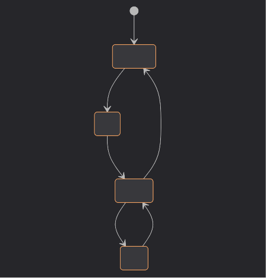</div>

Diagrams are on by default. A note with no diagrams behaves exactly as before, and the diagram engine never loads until you actually open a note that has one.

> The diagrams on this page render live when diagrams are on (the default). If they still look like code blocks, the switch has been turned off, or you are reading this somewhere without Mermaid support.

## Turning it on and off

Settings &middot; Content &middot; Diagrams &middot; **Render Mermaid diagrams**. It is on by default.

Turned off, a `mermaid` block shows as an ordinary code block, so you can see and copy the source. Turn it back on and it is drawn as a diagram the next time the note is read or edited.

The engine is about 3 MB. It downloads the first time you open a note that contains a diagram and then stays cached, so diagram-free notes pay nothing for it.

## Writing a diagram

Fence a block like code, but use `mermaid` as the label. Three backticks, then `mermaid`, the diagram description, then three backticks:

````
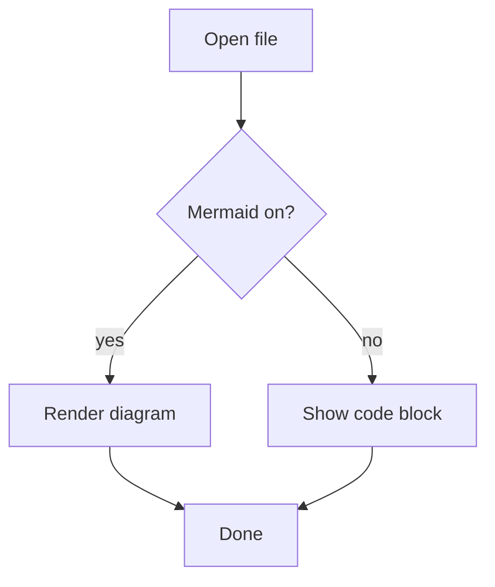
````

which draws:


The first line picks the diagram type (`flowchart`, `sequenceDiagram`, `classDiagram`, and so on). Everything after it is that type's own syntax. The [Mermaid documentation](https://mermaid.js.org/intro/) is the full reference; the sections below show the common types so you can start without it.

## Reading and editing

Diagrams draw both when you are reading a note and while you are editing it in Live mode.

- **Reading** shows the finished diagram.
- **Live** shows the diagram too, until you click it. A click drops your cursor into the block and brings the source back so you can edit it. Click away and it redraws.
- **Source** always shows the raw text.

So you never leave your note to change a diagram: click, edit the description, click out, done.

## The diagram types

A tour of the ones people reach for most. Each is the exact text you would put inside a `mermaid` block.

### Flowchart

Boxes and arrows. `TD` is top-down, `LR` is left-to-right.

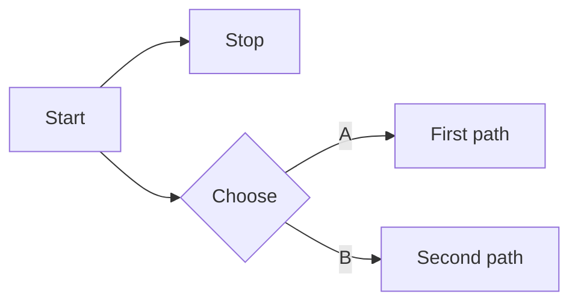

### Sequence diagram

Who talks to whom, over time.

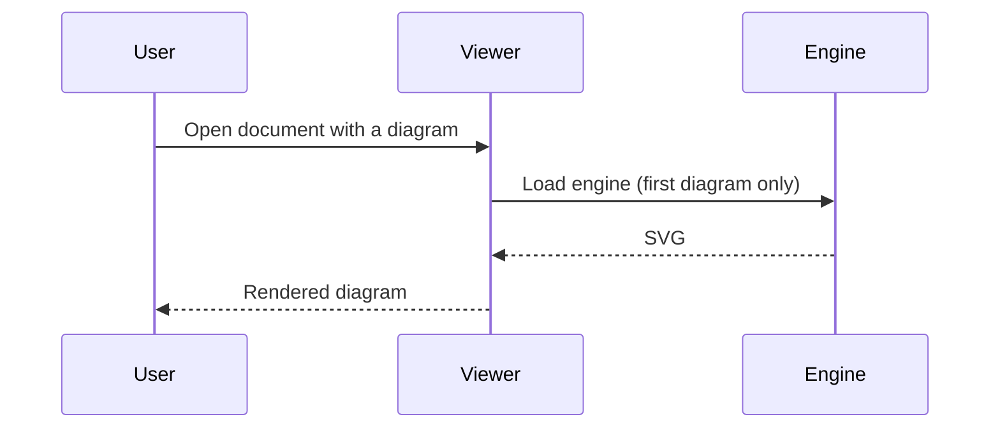

### Class diagram

Types and how they relate.

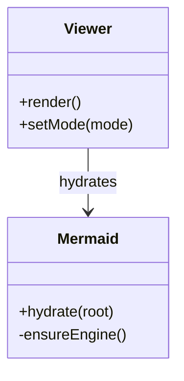

### State diagram

States and the moves between them.

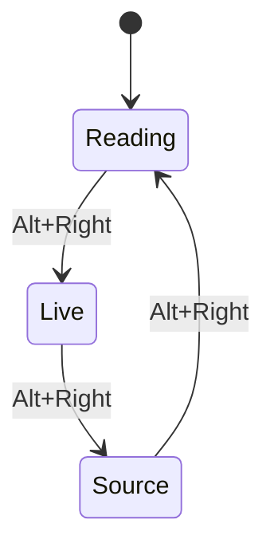

### Pie chart

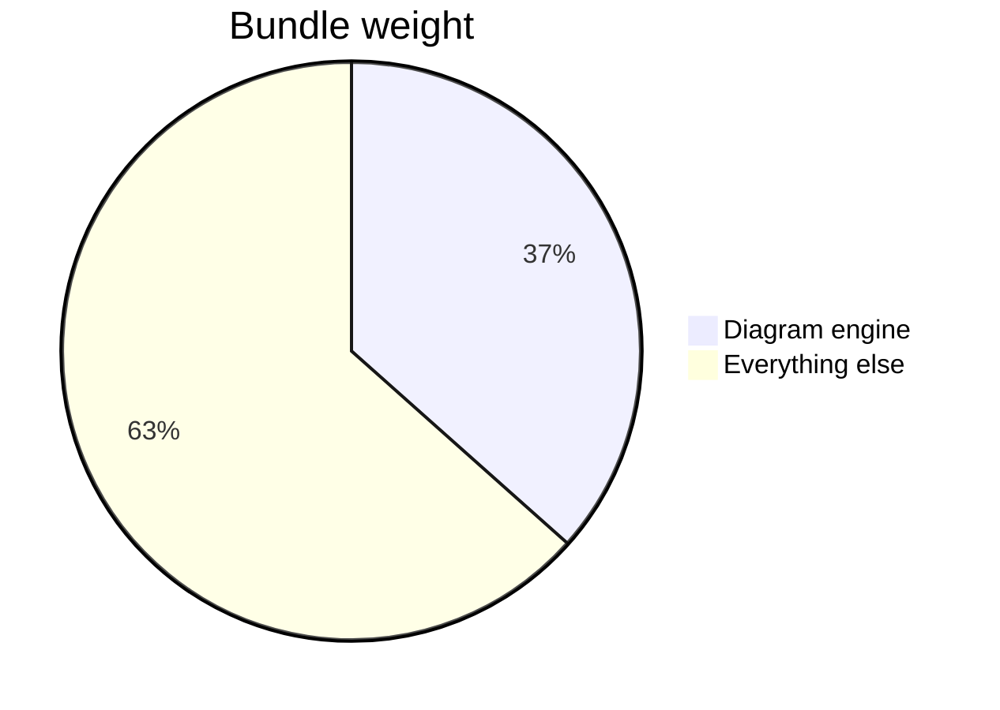

### Gantt chart

A simple schedule.

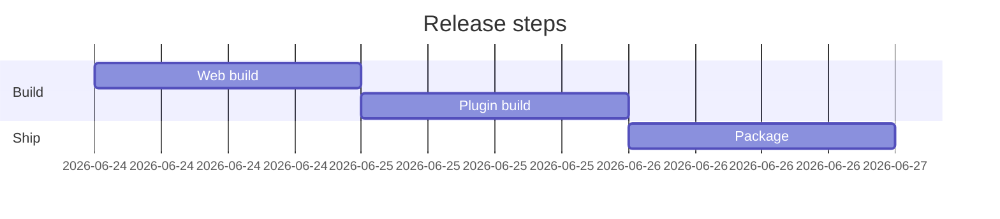

### Entity relationship

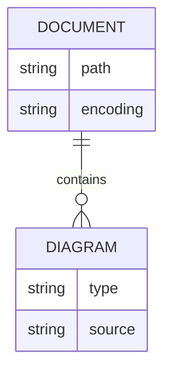

### And the rest

DopusWorX hands your block straight to Mermaid, so every diagram type Mermaid
supports works: on top of the ones above, that includes git graphs, quadrant
charts, user journeys, timelines, mindmaps, requirement diagrams, XY charts,
sankey, C4, block, packet, kanban and more. The colour theming covers the
series-based ones, so git branches, quadrant cells, gantt sections, XY-chart bars
and user-journey boxes all come out in distinct palette colours.

<div align="center">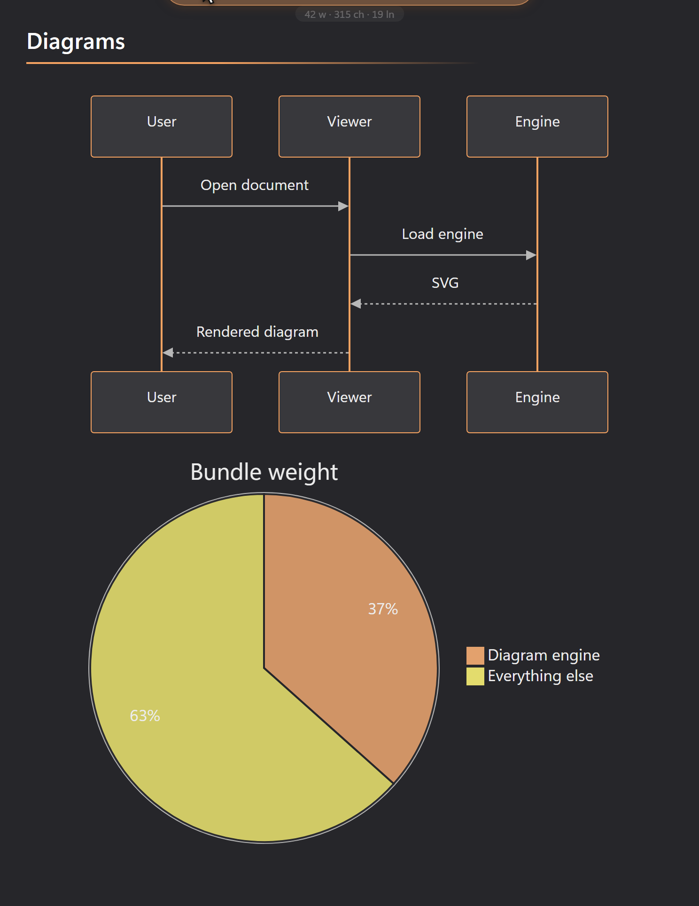</div>

## Diagram settings

All eight sit under Settings &middot; Content &middot; Diagrams, next to the on/off switch. Every one is optional, and the defaults give the standard look, so you only need to touch them when you want to change something.

| Setting | What it does |
|---|---|
| **Diagram theme** | Colours for diagrams, drawn from the same palettes as the page. **Match page** (the default) takes its colours from your active palette: node fills, text, the accent on borders, and the connector lines, so a diagram looks like part of the document and stays readable on any palette, light or dark. Or pick any built-in palette by name (Dracula, Nord, Catppuccin, GitHub Light…) to colour diagrams with it regardless of the page. Every option keeps connectors in a soft ink so lines never wash out, unlike Mermaid's own themes. Pie slices, gantt sections and other multi-part diagrams get a spread of distinguishable colours from the same palette, so segments are easy to tell apart. |
| **Diagram style** | **Classic** is the clean default. **Hand-drawn** gives a sketched look. The effect is subtle: it roughens the node outlines and adds a faint hatch to their fill, rather than redrawing the whole diagram. |
| **Flowchart edges** | How flowchart connector lines are drawn: Curved (default), Straight, Stepped, Natural or Cardinal. Only flowcharts use this; other diagram types ignore it. |
| **Diagram font** | The font for text inside diagrams. Leave it **empty** to follow the Body font, so diagrams match your prose. Set it to give diagrams their own font without touching the document font. |
| **Diagram font size** | Text size inside diagrams: Tiny, Small, Medium (default), Large or Extra large. |
| **Wrap long labels** | Wraps long text in nodes and labels instead of stretching the diagram wide. Off by default. |
| **Number sequence steps** | Sequence diagrams only: numbers each message in order. Off by default. |
| **Max connections per diagram** | A safety limit on how many connectors one diagram may have (the default is 500). If a large diagram reports too many edges and refuses to draw, raise this. |

A change applies straight away: any diagram on screen redraws with the new setting, and the cache keeps a separate copy per combination so flipping back is instant. Because Match page reads your palette, switching the page between light and dark also recolours the diagrams to suit.

<div align="center">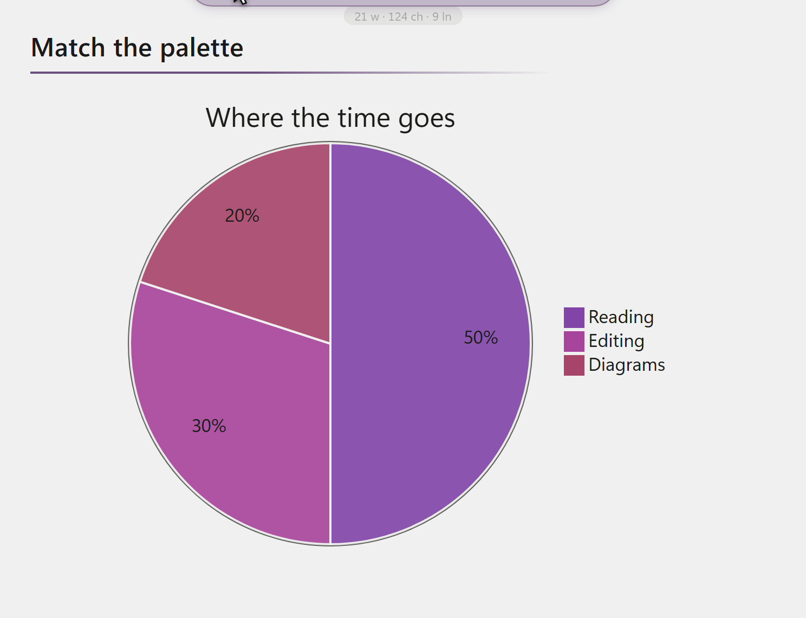</div>

### How the settings dialog works

The settings used here behave like every other DopusWorX setting:

- **Live preview.** Most changes show in the viewer as soon as you make them, before you click anything else.
- **Empty means default.** Leaving a field blank (like Diagram font) is not the same as a value; it means "use the default", which keeps adapting if the default ever changes.
- **It is saved on Apply**, to `%APPDATA%\HyperWorX\DopusWorX\settings.json`. Only values you have changed from the default are written, so your file stays small and forward-compatible.

## When a diagram does not show up

DopusWorX never silently drops a diagram. You always get the diagram or a visible reason.

- **It still looks like a code block.** Diagrams have been turned off, or the fence label is not exactly `mermaid`.
- **A brief flash of source is normal.** The first diagram in a note shows its text for an instant while the engine wakes up, then becomes the diagram. That is not a fault.
- **A red ⚠ box with your text in it.** The description could not be parsed. Hover the box for Mermaid's own reason. The source is always shown inside the box, so nothing is lost. A broken diagram never takes the rest of the note down with it:

```mermaid
flowchart TD
    A --> ??? this is not valid (((
```

(That block is deliberately broken, to show the error box.)


## A little about what happens behind the scenes

You never have to think about any of this, but in case you are curious:

- **Notes without diagrams stay quick.** The engine loads only the first time you open a note that has a diagram, so diagram-free files pay nothing.
- **Diagrams are rendered once and cached**, keyed by their source and the current theme, font, style and edge settings. Reading and Live share the cache, so switching modes paints the diagram straight away with no re-render.
- **The output is sanitised.** Mermaid runs with its strict security level, which drops click and script directives, and DopusWorX runs the resulting SVG through a second sanitiser before it goes on the page. A diagram label that contains markup shows as plain text, never as live HTML.
- **Labels are safe text.** `A["<b>bold?</b>"]` renders the angle-bracket text literally rather than running it.
