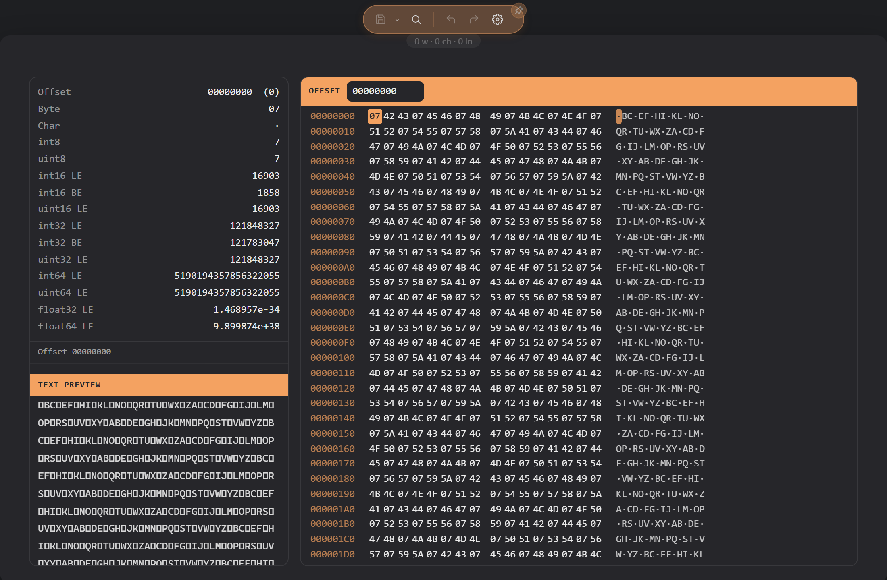
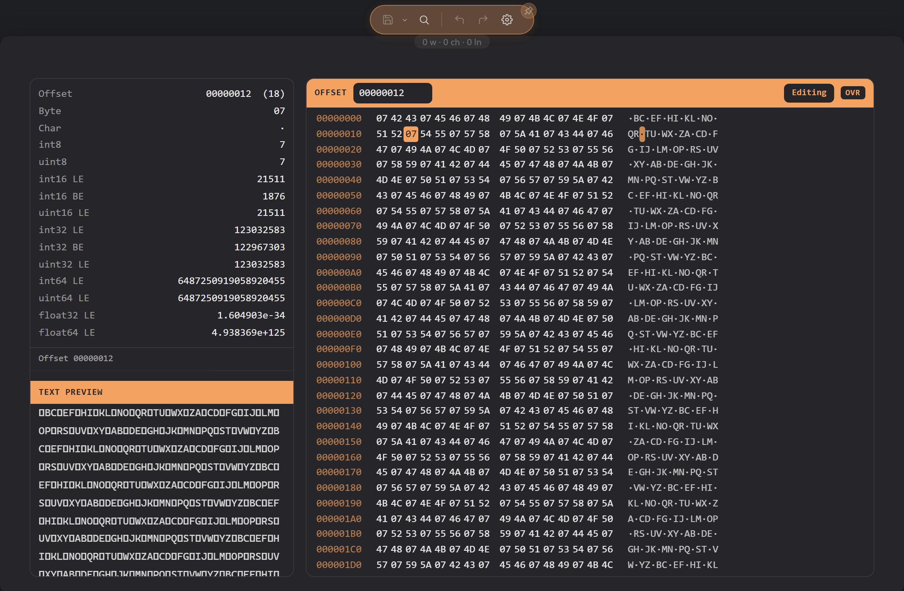

# Binary inspector

A file that is binary rather than text opens in the binary inspector: a hex view of its bytes, with a panel that reads the values under your cursor. DopusWorX decides a file is binary by looking at its content, not its name, so a binary with a text-like extension still opens here, and a text file with an unusual extension does not.

The inspector is on by default. Turn **Binary inspector** off in Settings to send binary files back to the plain not-text notice instead.

## Limits

The inspector fetches the file's raw bytes in a single request before rendering begins. The hex view's scrolling is virtualised -- only visible rows are rendered -- but the full file must be read up front. Files larger than 100 MiB cannot be loaded; the inspector shows 'Could not read this file as bytes.' instead of the hex view.

## The hex view

The view has the three classic columns: the byte offset down the left, the bytes as hex in the middle, and the same bytes as text on the right, with anything unprintable shown as a dot. It is virtualised, so a large file scrolls smoothly without loading all of it into the page at once.

## The data inspector

Down the side, the data inspector reads the bytes starting at the cursor as the common types at once: the offset in hex and decimal, the byte's hex value and character, signed and unsigned 8-bit integers, signed and unsigned 16- and 32-bit integers in both little- and big-endian form (unsigned 16/32 in little-endian only), signed and unsigned 64-bit integers and 32- and 64-bit floats in little-endian form; a type that runs past the end of the file shows a dash. Move the cursor and the readings update to match the new position.

Below the readings, a status line shows the current cursor position as a hex offset, or the start and end offsets and byte count when a range is selected. Below that, a text preview pane shows the file's bytes interpreted as Latin-1 characters; for files larger than 1 MiB only the first 1 MiB is shown and the pane heading says so. Drag the divider between the value pane and the hex pane to resize them.

## Selecting bytes

- Click a byte to put the cursor on it.
- Shift-click, or click and drag, to select a range.
- Ctrl+A selects the whole file.

You can also move the cursor and extend the selection from the keyboard when the hex pane has focus:

- Left and Right arrows move one byte at a time; Up and Down move one row.
- PageUp and PageDown move a full screen at a time.
- Home jumps to the start of the current row; End jumps to the end of it.
- Ctrl+Home jumps to the first byte in the file; Ctrl+End jumps to the last.
- Hold Shift with any of the above to extend the selection rather than move the cursor.

The selection drives Copy (below).

## Going to an offset

An Offset field sits permanently at the top of the hex pane and shows the cursor's current byte offset as a live readout. Press Ctrl+G (or right-click and choose **Go to offset**) to focus it. Type a hex offset (with or without a `0x` prefix), or force decimal with a leading `#` or a trailing `d` or `.` (for example, `#1024` or `1024d`), and press Enter to jump. The view scrolls to that byte and puts the cursor on it.

## Searching

Open the find bar with Ctrl+F. A **Hex** toggle in the bar switches what it searches for:

- With Hex off, it searches for text, matching the bytes of what you type.
- With Hex on, it searches for a hex pattern, so `4d 5a` finds those two bytes in order.

Text search is case-insensitive by default; press the case toggle in the find bar to make it case-sensitive (folding covers unaccented A-Z only). The bar shows which match you are on out of how many, or 'no matches' when none are found, or 'bad hex' for an invalid hex pattern. Previous and next wrap around at the ends of the file.

## Copying

Right-click to open the copy options. Two items are always present: **Copy as hex** copies the whole file as space-separated hex bytes, and **Copy text** copies it as a Latin-1 string (each byte becomes the character at that code point). When you have a range selected, two additional items appear above those: **Copy selection as hex (N bytes)** and **Copy selection text**, which copy only the selected bytes in the same formats. There is no separate Copy submenu -- all items sit at the top level of the right-click menu.

## View as hex, view as text

Any file can be opened in the inspector on demand, not only the ones detected as binary. Right-click and choose **View as hex** to open the current file in the inspector, and **View as text** to go back to the normal text or code view. This is useful for peeking at the bytes of a file that is technically text, or for forcing a borderline file one way or the other. View as hex is available while the **Binary inspector** setting is on; turning it off removes the command as well as the automatic routing.

## Editing bytes

The inspector is read-only out of the box. Turn on **Allow binary editing** in Settings (it needs the Binary inspector on) and the hex pane gains an **Edit** toggle. With Edit on:

- Typing **overwrites** the byte under the cursor. Type in the hex column, two characters to a byte, or in the text column, one character to a byte.
- The header shows an **OVR/INS** button next to Edit that displays the current mode; click it (or press **Insert**) to switch between overwrite and insert mode.
- **Tab** moves typing focus between the hex and text columns.
- **Delete** and **Backspace** remove bytes.
- Bytes you have changed are highlighted until you save.
- Undo and redo work as everywhere else.
- **Ctrl+S** writes the changes back to the file, through the same safe-save path as every other format.
- The right-click menu gains **Edit bytes** (to enter or leave editing), **Delete byte** or **Delete selection** while editing, and **Save** once there are unsaved changes.

Unsaved byte edits live only in the inspector -- switching to View as text or opening another file discards them without asking (the file on disc is untouched); save with Ctrl+S first. Refreshing does prompt you before discarding.

Editing raw bytes can corrupt a file that another program expects in a particular shape, so the editor stays off until you switch it on.
