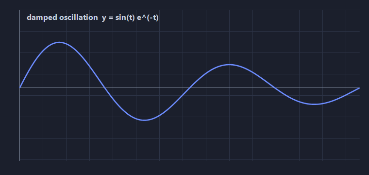

# DopusWorX

A document viewer and in-place editor that lives inside **Directory Opus**. Open a
file with a single click to preview it in the viewer pane, or double-click once the
file association is set up. This file is both a manual and a working exhibition:
every core Markdown and maths feature it describes is rendered live in the document
you are reading, so try it as you go.

## The three modes

The toolbar switches the document between three modes. Most of what follows behaves
differently in each, so it is worth knowing them first:

- **Reading** is read-only and fully rendered, like a finished page.
- **Live** is rendered too, but the formatting marks for the line your cursor is on
  stay visible, so you can edit in place without losing the rendered view.
- **Source** is the raw text, with syntax highlighting.

Switch this document between the three now and watch the headings, tables and
equations below change between rendered and raw.

## Text formatting

You can write **bold**, *italic*, ***bold italic***, ~~strikethrough~~,
==highlight==, and `inline code`. Subscript and superscript work too, so H~2~O and
E = mc^2^ read correctly. Links look like [this](https://www.gpsoft.com.au/) and
open in your browser from Reading mode.

> Blockquotes are supported, and they nest.
>
> > Like this, which is handy for quoting a reply inside a reply.

## Lists

Unordered:

- Open a file with a single click to preview it
- Edit it in Live mode without leaving the viewer
- Save from the toolbar or with auto-save

Ordered, with nesting:

1. First
2. Second
   1. Nested second-point-one
   2. Nested second-point-two
3. Third

Task lists are interactive. Tick the boxes in Live or Reading mode and the source
updates to match:

- [x] Render Markdown
- [x] Edit in place
- [ ] Tick this one yourself

## Tables

Columns take per-column alignment, set by the colons in the header rule:

| Feature          | Reading | Live | Source |
|------------------|:-------:|:----:|-------:|
| Rendered view    |   yes   | yes  |      - |
| Formatting marks |    -    | yes  |    yes |
| Raw text         |    -    |  -   |    yes |

## Code

Fenced blocks are syntax-highlighted and carry a copy button in the corner:

```python
def greet(name: str) -> str:
    return f"Hello, {name}, from DopusWorX!"

print(greet("world"))
```

```javascript
const modes = ["reading", "live", "source"];
modes.forEach((m) => console.log(`mode: ${m}`));
```

The `code/` samples alongside this file show the highlighter across many more
languages.

## Maths

DopusWorX renders LaTeX-style maths inline with the text and as centred display
blocks. Inline maths goes between single dollar signs, and display maths between
double dollar signs. In Live and Source mode you edit the raw LaTeX and the preview
updates as you type. The rendering engine, the maths font, and the symbol panel are
all set in Settings, so the same document can be typeset in whichever maths font you
prefer.

Inline maths keeps the line height of the surrounding text, so it never pushes the
paragraph apart. The mass-energy equivalence $E = mc^2$ sits in the run of text, as
does the golden ratio $\varphi = \tfrac{1 + \sqrt{5}}{2}$ and a finite sum
$\sum_{i=1}^{n} i = \tfrac{n(n+1)}{2}$. The fraction and the radical shrink to fit
the line rather than breaking it.

Display blocks stand on their own and centre on the page. The Gaussian integral
leans on the renderer where it tends to struggle, a tall operator with infinite
limits over a nested square root:

$$
\int_{-\infty}^{\infty} e^{-x^2}\,dx = \sqrt{\pi}
$$

The quadratic formula stretches a single fraction bar across a surd, which is a fair
test of how fractions and roots nest:

$$
x = \frac{-b \pm \sqrt{b^2 - 4ac}}{2a}
$$

Euler's identity ties together five fundamental constants in one line, and shows that
short equations still get the display treatment:

$$
e^{i\pi} + 1 = 0
$$

Matrices come through with proper delimiters. Setting the matrix and its determinant
side by side shows block and inline maths sharing a row:

$$
A = \begin{pmatrix} a & b \\ c & d \end{pmatrix}
\qquad
\det(A) = ad - bc
$$

Multi-line working stays aligned on the equals sign, so a derivation reads down the
page as one piece:

$$
\begin{aligned}
(a + b)^2 &= a^2 + 2ab + b^2 \\
(a - b)^2 &= a^2 - 2ab + b^2 \\
a^2 - b^2 &= (a + b)(a - b)
\end{aligned}
$$

It also holds up under real notation, not just textbook one-liners. Bold vectors,
partial derivatives and the nabla operator all render together in the incompressible
Navier-Stokes momentum equation:

$$
\rho\left(\frac{\partial \mathbf{u}}{\partial t} + (\mathbf{u}\cdot\nabla)\mathbf{u}\right) = -\nabla p + \mu\nabla^2\mathbf{u} + \mathbf{f}
$$

And the Maxwell-Ampere law:

$$
\nabla\times\mathbf{B} = \mu_0\mathbf{J} + \mu_0\varepsilon_0\frac{\partial \mathbf{E}}{\partial t}
$$

Edit any of these in Live or Source mode and the preview re-renders on the fly.

## Images

DopusWorX understands both the standard Markdown image syntax and Obsidian-style
embeds, and both take an optional pixel width after a pipe. Use the Obsidian embed
when you just want a file pulled in by name; here the width is 420 pixels:

![[field.png|420]]

Use the standard form when you also want alt text, which DopusWorX renders as a
caption beneath the image. Here "flow" is the caption and 360 is the width:



## Footnotes

Markdown footnotes are editable in place.[^1] The note lives at the bottom of the
document and keeps its link to the reference,[^long] so in Live mode you can scroll
down, click into the note and edit it without breaking the jump back.

[^1]: This is a footnote. Click into it in Live mode to edit it.
[^long]: Footnotes can hold multiple sentences, `code`, and **formatting**.

## Definition lists

Reading mode
: The finished, fully-rendered view.

Live mode
: Rendered, but with editable formatting marks on the active line.

Source mode
: The raw text, syntax-highlighted.

## Abbreviations

Hover an abbreviation in Reading mode for its full term. The HTML spec is maintained
by the W3C.

*[HTML]: Hyper Text Markup Language
*[W3C]: World Wide Web Consortium

## More to try

The other files beside this one each exercise a different view:

- `data.csv` opens in the sortable, in-cell-editable CSV grid.
- `sample.html` renders as its own styled page in the HTML view.
- `code/` holds source files and a one-block-per-language sheet for the highlighter.
- `encodings/international.md` mixes scripts (CJK, Arabic, Hebrew, Greek, emoji) to
  show encoding and bidirectional handling.

Nothing here is special. Edit these files, save them, or throw them away; they will
not affect the plugin.
